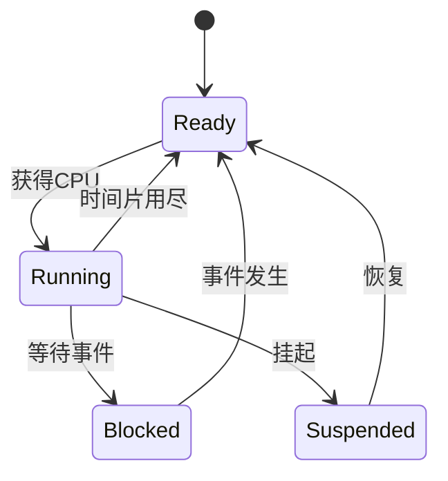

# FreeRTOS Basics and API Guide for STM32 Beginners

> Goal: After reading this guide, you can independently set up a minimal FreeRTOS project with "2 tasks + 1 queue + 1 semaphore".

## Table of Contents

- 1. Establish overall understanding first
- 2. Task execution states (core)
- 3. Key concepts: scheduling, Tick, critical section, heap and stack
- 4. Core API quick reference (native FreeRTOS)
- 5. From 0 to 1: minimal project mental model
- 6. Common beginner pitfalls and troubleshooting
- 7. 5-day beginner practice checklist
- 8. Native API vs CMSIS-RTOS v2 comparison

---

## 1. Establish Overall Understanding First

FreeRTOS is essentially a kernel that does three things for you:

1. Manage multiple tasks.
2. Schedule tasks to run based on priority and timing.
3. Provide inter-task communication mechanisms (queues, semaphores, event groups, etc.).

You can think of it as "a micro operating system kernel on a microcontroller":

- `main()` does hardware initialization.
- Create tasks.
- Start the scheduler.
- From then on, the kernel takes over CPU allocation.

---

## 2. Task Execution States (Core)


### 2.2 Task State Flow (Visualization)



### 2.3 Most Common Confusion for Beginners

- `Blocked` is "passively waiting for a condition", it automatically returns to `Ready` when the condition is met.
- `Suspended` is "manual freezing", it does not automatically recover.

---

## 3. Key Concepts: Scheduling, Tick, Critical Section, Heap and Stack

### 3.1 Priority and Preemption

- FreeRTOS typically uses "highest priority runs first".
- When preemption is enabled (`configUSE_PREEMPTION=1`), a higher priority task becoming ready will preempt a lower priority task.
- Whether same-priority time slicing occurs depends on `configUSE_TIME_SLICING`.

Recommendations:

- Start by dividing task priorities into 2-3 levels, don't spread them out initially.
- Only put "short, urgent, critical" tasks in high priority.

### 3.2 Tick and Delay

- Tick is the kernel's periodic interrupt (e.g., 1ms once, depends on `configTICK_RATE_HZ`).
- The parameter unit for `vTaskDelay()` is Tick, not ms.
- It is recommended to use `pdMS_TO_TICKS(ms)` for conversion.

Example:

```c
vTaskDelay(pdMS_TO_TICKS(500));
```

`vTaskDelay()` vs `vTaskDelayUntil()`:

- `vTaskDelay()`: Relative delay, will accumulate drift in loops.
- `vTaskDelayUntil()`: Absolute periodicity, more suitable for periodic tasks.

### 3.3 Critical Section

Used to protect shared resources, preventing concurrent access from corrupting data.

Common in task context:

```c
taskENTER_CRITICAL();
/* critical section */
taskEXIT_CRITICAL();
```

Principles:

- Keep critical sections short.
- Do not perform blocking operations (such as queue blocking wait) inside critical sections.

### 3.4 Idle Task and Tick Hook

- Idle Task runs when "no task is runnable".
- You can use Idle Hook/Tick Hook for lightweight background work (must be very short).
- It is not recommended to write complex logic in Hooks.

### 3.5 Heap and Stack (Must Be Distinguished)

- Stack: Each task is independent, stores function local variables/call context.
- Heap: System dynamic allocation area, task control blocks, queues, etc. are often allocated from heap.

Common problems:

- Task stack too small → stack overflow.
- Improper `heap_x.c` selection or heap too small → object creation failure.

---

## 4. Core API Quick Reference (Native FreeRTOS)

> Note: The following focuses on native APIs; for CMSIS comparison, see Section 8.

### 4.1 Task Management

1. `xTaskCreate()`: Create a task.
2. `vTaskDelete()`: Delete a task.
3. `vTaskDelay()`: Relative delay.
4. `vTaskDelayUntil()`: Fixed period delay.
5. `vTaskSuspend()` / `vTaskResume()`: Suspend/resume tasks.

Minimal example:

```c
xTaskCreate(TaskA, "A", 256, NULL, 2, NULL);
xTaskCreate(TaskB, "B", 256, NULL, 1, NULL);
vTaskStartScheduler();
```

### 4.2 Queue

Purpose: Pass data between tasks (most commonly used).

1. `xQueueCreate(len, item_size)`
2. `xQueueSend()` / `xQueueReceive()`

Example:

```c
QueueHandle_t q = xQueueCreate(8, sizeof(uint32_t));
uint32_t v = 123;
xQueueSend(q, &v, pdMS_TO_TICKS(10));
xQueueReceive(q, &v, portMAX_DELAY);
```

Note:

- `item_size` must match the send/receive data type.
- The timeout parameter unit for send/receive is Tick.

### 4.3 Semaphore and Mutex

- Binary semaphore: Event synchronization.
- Counting semaphore: Resource counting.
- Mutex: Shared resource mutual exclusion, with priority inheritance.

Common APIs:

1. `xSemaphoreCreateBinary()`
2. `xSemaphoreCreateCounting()`
3. `xSemaphoreCreateMutex()`
4. `xSemaphoreTake()` / `xSemaphoreGive()`

Recommendations:

- Mutex is preferred for protecting shared peripherals (such as UART).
- Binary semaphore or task notification is commonly used for ISR-to-task synchronization.

### 4.4 Event Group

Purpose: Combined judgment of multiple event bits (e.g., "network ready + sensor ready").

1. `xEventGroupCreate()`
2. `xEventGroupSetBits()`
3. `xEventGroupWaitBits()`

### 4.5 Software Timer

Purpose: Execute lightweight callbacks periodically.

1. `xTimerCreate()`
2. `xTimerStart()`
3. Avoid time-consuming and blocking operations in callback functions.

### 4.6 Interrupt Cooperation (ISR and Task)

Rules:

- Must use `FromISR` version API in ISR.
- When a task switch may be triggered, call `portYIELD_FROM_ISR()`.

Example:

```c
BaseType_t hpw = pdFALSE;
xQueueSendFromISR(q, &data, &hpw);
portYIELD_FROM_ISR(hpw);
```

Interrupt priority note:

- On Cortex-M, ensure the interrupt priority configuration allows FreeRTOS API calls.
- Focus on `configMAX_SYSCALL_INTERRUPT_PRIORITY`.

---

## 5. From 0 to 1: Minimal Project Mental Model

### 5.1 Recommended `main()` Order

1. Clock/interrupt group initialization.
2. Peripheral initialization (GPIO/UART, etc.).
3. Create communication objects (Queue/Semaphore).
4. Create tasks.
5. `vTaskStartScheduler()` to start the scheduler.

### 5.2 Task Division Recommendations (Beginner Version)

- Acquisition task: Read sensors, send to queue.
- Processing task: Receive from queue, calculate.
- Output task: UART/screen output.

Avoid:

- One task doing everything.
- Multiple tasks directly operating the same peripheral without mutual exclusion.

### 5.3 Typical Dual-Task Flow (LED + UART)

- Task A (LED): Toggles every 500ms to prove scheduling is running.
- Task B (UART): Prints count every 1s.
- Set both tasks to the same priority initially, then optimize after confirming stability.

Success criteria:

- LED blinks regularly.
- UART prints stably, system does not freeze or produce garbled output.

---

## 6. Common Beginner Pitfalls and Troubleshooting

### 6.1 Stack Overflow

Symptoms: Unexplained HardFault, random freezes.

Troubleshooting:

1. Enable stack overflow detection (`configCHECK_FOR_STACK_OVERFLOW`).
2. Increase the stack of suspicious tasks.
3. Avoid putting large arrays on stack, use static or heap instead.

### 6.2 Wrong Blocking Time Unit

- Treating Tick as ms will cause timing chaos.
- Use `pdMS_TO_TICKS()` uniformly.

### 6.3 Using Wrong API in ISR

- Using `xQueueSend()` instead of `xQueueSendFromISR()` in ISR.
- The result may be assertion failure or abnormal behavior.

### 6.4 Queue Length or Element Size Mismatch

- Mismatch between queue element definition and actual send/receive type will cause "seems to run but data garbled".

### 6.5 Deadlock

- Task A waits for Task B's lock, Task B waits for Task A's lock.
- Keep lock ordering consistent, reduce nested locks.

### 6.6 Priority Inversion

- Low priority holding mutex resource causes high priority to be indirectly blocked.
- Use mutexes for shared resources (has priority inheritance).

### 6.7 `printf` Risks

- Large stack usage, time-consuming, reentrancy risks.
- Recommendations:
  - Reduce print frequency.
  - Avoid printing in ISR.
  - Use lightweight logging on critical paths.

---

## 7. 5-Day Beginner Practice Checklist

### Day 1: Get a Minimal Dual-Task Running

- Goal: LED task + UART task running concurrently.
- Verify: LED blinks steadily, UART outputs once per second.

### Day 2: Queue Communication

- Goal: TaskA sends count to queue, TaskB receives and prints.
- Verify: Printed values are continuous with no loss.

### Day 3: Semaphore Synchronization

- Goal: Button interrupt releases semaphore, task is awakened to handle.
- Verify: Task blocks without button press, responds immediately after press.

### Day 4: Software Timer

- Goal: Software timer periodically triggers status reporting.
- Verify: Callback executes at fixed period.

### Day 5: ISR to Task Notification

- Goal: Interrupt uses `FromISR` API to awaken task.
- Verify: Task runs quickly after interrupt response, system is stable.

---

## 8. Native API vs CMSIS-RTOS v2 Comparison

Only the most common mappings are listed for quick switching when reading different tutorials:

- Task creation: `xTaskCreate` <-> `osThreadNew`
- Delay: `vTaskDelay` <-> `osDelay`
- Start scheduler: `vTaskStartScheduler` <-> `osKernelStart`
- Queue send/receive: `xQueueSend/xQueueReceive` <-> `osMessageQueuePut/osMessageQueueGet`
- Semaphore take/give: `xSemaphoreTake/xSemaphoreGive` <-> `osSemaphoreAcquire/osSemaphoreRelease`

Conclusion:

- Beginners are recommended to master native FreeRTOS APIs first, then look at CMSIS wrappers.
- The concepts are the same, main differences are in naming and wrapper layer.

---

## Final Checklist (Review Before Writing Code)

- Have you used `pdMS_TO_TICKS()` uniformly for Tick and ms?
- Are all ISRs using `FromISR` API?
- Are shared peripherals protected with mutual exclusion?
- Do task stack sizes have margin?
- Are blocking waits all set with reasonable timeouts?

---

## 9. Directly Runnable Minimal Project Template (Can Be Copied to STM32 Project)

The following example is a minimal FreeRTOS skeleton that can be directly copied to your project: two tasks (LED, UART), one queue and one mutex. Note: Peripheral initialization (UART/GPIO) should be replaced according to your HAL/LL implementation.

```c
/* Global objects */
QueueHandle_t g_queue;
SemaphoreHandle_t g_uartMutex;

void LedTask(void *pvParameters)
{
    (void) pvParameters;
    for (;;)
    {
        HAL_GPIO_TogglePin(LED_GPIO_Port, LED_Pin);
        vTaskDelay(pdMS_TO_TICKS(500)); // Blocked state
    }
}

void UartTask(void *pvParameters)
{
    (void) pvParameters;
    uint32_t cnt = 0;
    char buf[64];

    for (;;)
    {
        if (xSemaphoreTake(g_uartMutex, pdMS_TO_TICKS(50)) == pdPASS)
        {
            int n = snprintf(buf, sizeof(buf), "cnt=%lu\r\n", (unsigned long)cnt++);
            HAL_UART_Transmit(&huart1, (uint8_t*)buf, n, HAL_MAX_DELAY);
            xSemaphoreGive(g_uartMutex);
        }
        vTaskDelay(pdMS_TO_TICKS(1000));
    }
}

int main(void)
{
    HAL_Init();
    SystemClock_Config();
    MX_GPIO_Init();
    MX_USART1_UART_Init();

    g_queue = xQueueCreate(8, sizeof(uint32_t));
    g_uartMutex = xSemaphoreCreateMutex();

    if (g_queue == NULL || g_uartMutex == NULL)
    {
        Error_Handler();
    }

    xTaskCreate(LedTask, "LED", 128, NULL, 1, NULL);
    xTaskCreate(UartTask, "UART", 256, NULL, 1, NULL);

    vTaskStartScheduler(); // Will not return, FreeRTOS takes over

    for (;;);
}
```

---

## 10. Common FreeRTOSConfig Macros and Behavior Mapping (Quick Reference)

- `configUSE_PREEMPTION = 1`: Enable preemption, higher priority task becoming ready will immediately switch to CPU.
- `configUSE_TIME_SLICING = 1`: Enable time slicing between same priority tasks (if 0, same priority may not slice).
- `configTICK_RATE_HZ`: Tick frequency (e.g., 1000 -> 1 tick = 1 ms), affects vTaskDelay, etc.
- `configMINIMAL_STACK_SIZE`: Default minimal task stack size, estimate reasonably when creating tasks.
- `configMAX_PRIORITIES`: Maximum number of priority levels allowed.
- `configCHECK_FOR_STACK_OVERFLOW`: Enable stack overflow detection (recommend setting to 1 or 2 and implement vApplicationStackOverflowHook).
- `configUSE_MUTEXES`: Enable mutexes (priority inheritance), recommended for shared peripheral protection.
- `configMAX_SYSCALL_INTERRUPT_PRIORITY` / Cortex-M interrupt priority configuration: Ensure interrupt priority using FreeRTOS API is not higher than this threshold.

Documentation should explain that these macros are typically modified in `FreeRTOSConfig.h`, and provide recommended values or ranges for common projects.

---

## 11. Common Incorrect vs Correct 写法对照 (Training Style Examples)

- Incorrect: Calling `xQueueSend()` in ISR (will cause unpredictable behavior or assertion)
  Correct: Call `xQueueSendFromISR()` in ISR and call `portYIELD_FROM_ISR()` when needed.

- Incorrect: Multiple tasks directly calling `HAL_UART_Transmit()` (not thread-safe, data may be interleaved)
  Correct: Create a mutex for UART, all tasks `xSemaphoreTake()` before sending, `xSemaphoreGive()` after.

- Incorrect: Queue creation `item_size` does not match passed type (e.g., sizeof(uint32_t) but passing struct pointer)
  Correct: Queue element size should exactly match the actual passed data type, or send pointer and ensure lifecycle.

- Incorrect: Making blocking calls in critical section (e.g., calling xQueueReceive(portMAX_DELAY) after taskENTER_CRITICAL())
  Correct: Only perform short, small, and non-blocking operations in critical sections, blocking operations should be outside critical sections.

---

## 12. Debugging and Observation: How to Diagnose Stack/Queue/Scheduling Problems

- View task stack high water mark: `uxTaskGetStackHighWaterMark()` returns the minimum remaining stack value used by a task (unit platform dependent), used to evaluate whether stack needs to be increased.
- Implement hooks: Implement `vApplicationStackOverflowHook()` and `vApplicationMallocFailedHook()`, record information when problems occur and safely restart or enter safe state.
- Use assertions: Enable `configASSERT()`, and output key information in assertion callback (such as current task name, register snapshot) for troubleshooting.
- Statistics and events: Use `vTaskList()` / `vTaskGetRunTimeStats()` (if runtime stats are enabled) to observe task running conditions and CPU usage.
- Fault injection: As an exercise, intentionally shrink queue length or set a task's stack too small, observe system behavior and use above tools to locate problems.

---

## Quick Reference Checklist (Newly Added)
- Runnable minimal project template see Section 9.
- Common errors and correct approaches see Section 11, debugging methods see Section 12.