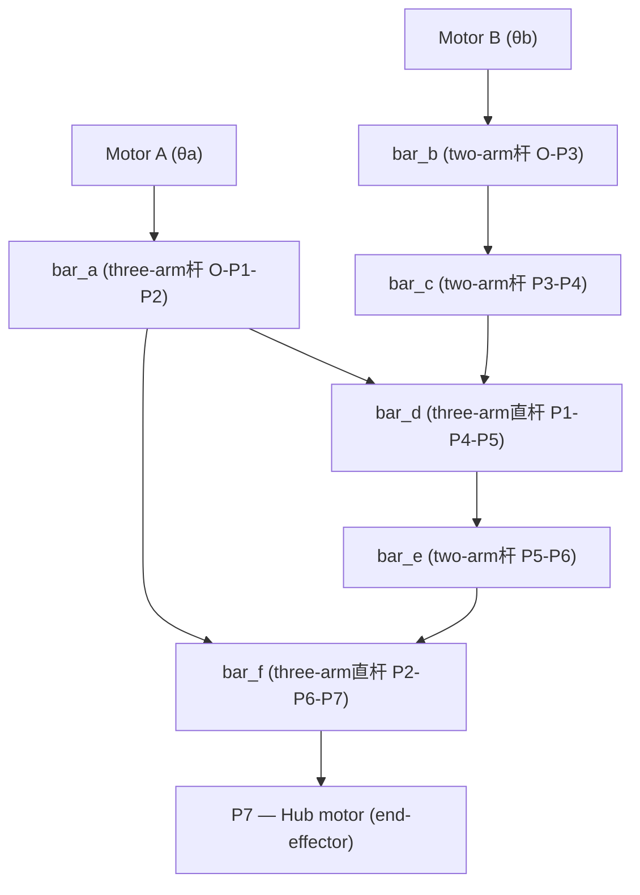

## 1. Problem Background

Each leg of a wheel-legged robot needs both **wheel rolling** and **leg obstacle-crossing** capabilities. The mechanism design discussed here uses two coaxial motors, transmitting power to the wheel through a figure-8 shaped double parallelogram linkage, achieving decoupled control of leg swinging and wheel steering.

Compared to traditional belt drive or gear drive solutions, this all-linkage mechanism has advantages of **zero backlash, high structural stiffness, no wearing parts**, making it especially suitable for wheel-legged robot applications requiring high-precision end-effector position control.




Two parallelograms nested in a figure-8 shape:

- **Parallelogram 1**: O – P1 – P4 – P3, side lengths 48.4 × 57.3 mm
- **Parallelogram 2**: P1 – P2 – P6 – P5, side lengths 59 × 32.4 mm


:::info
The key point is: all three-arm bars (bar_a, bar_d, bar_f) are **straight bars** (three points collinear). This geometric constraint is the core prerequisite for subsequent analytical simplification.
:::

## 2. Forward Kinematics Derivation

The goal of forward kinematics is: given motor angles $\theta_a, \theta_b$, find the position of end-effector $P_7$.

### 2.1 Point Coordinates Step-by-Step Solution

**Step 1 — P1, P2 on bar_a**

Using O as origin, rotated by $\theta_a$:

$$
\begin{aligned}
P_1 &= L_{OP1} \begin{bmatrix}\cos\theta_a \\ \sin\theta_a\end{bmatrix}
      = 48.4 \begin{bmatrix}\cos\theta_a \\ \sin\theta_a\end{bmatrix} \\[6pt]
P_2 &= L_{OP2} \begin{bmatrix}\cos\theta_a \\ \sin\theta_a\end{bmatrix}
      = 107.4 \begin{bmatrix}\cos\theta_a \\ \sin\theta_a\end{bmatrix}
\end{aligned}
$$

Here $L_{OP2} = 48.4 + 59 = 107.4$, because bar_a is a straight bar, P1 lies on the O–P2 line.

**Step 2 — P3 on bar_b**

$$
P_3 = L_b \begin{bmatrix}\cos\theta_b \\ \sin\theta_b\end{bmatrix}
     = 57.3 \begin{bmatrix}\cos\theta_b \\ \sin\theta_b\end{bmatrix}
$$

**Step 3 — P4 on bar_d (intersection of two circles)**

From parallelogram 1, we know $|P_1P_4|$, $|P_3P_4|$ are fixed values, so P4 is the intersection of two circles:

- Circle center $P_1$, radius $L_{P1P4} = 57.3$
- Circle center $P_3$, radius $L_c = 48.4$

The analytical solution process for intersection of two circles is as follows. Let vector $\mathbf{v} = P_3 - P_1$, distance between centers $d = \|\mathbf{v}\|$, then:

$$
\begin{aligned}
a &= \frac{L_{P1P4}^2 - L_c^2 + d^2}{2d} \\[4pt]
h &= \sqrt{L_{P1P4}^2 - a^2} \\[4pt]
P_4 &= P_1 + \frac{a}{d}\mathbf{v} \pm \frac{h}{d}\mathbf{R}\mathbf{v}
\end{aligned}
$$

Where $\mathbf{R} = \begin{bmatrix}0 & -1 \\ 1 & 0\end{bmatrix}$ is the $90^\circ$ rotation matrix, the $\pm$ sign corresponds to two assembly modes, denoted as $\mathrm{branch}\_d = \pm 1$.

### 2.2 Core Simplification: Straight Bar Constraint

After obtaining P4, the direction angle of bar_d is:

$$
\theta_d = \text{atan2}(P_4 - P_1)
$$

Because bar_d is a **straight bar**, P5 is collinear with P1, P4, and $|P_1P_5| = 32.4$, so:

$$
P_5 = P_1 + \frac{32.4}{57.3} (P_4 - P_1)
$$

Substituting the relationship of parallelogram 2: $P_6 = P_2 + P_5 - P_1$, eliminating P5:

$$
P_6 = P_2 - \frac{32.4}{57.3} (P_4 - P_1)
$$

Note that the direction of $P_4 - P_1$ is the same as $P_3$ (opposite sides of parallelogram are parallel), and $P_3 = L_b[\cos\theta_b, \sin\theta_b]^T$, so:

$$
P_6 = P_2 - 32.4 \begin{bmatrix}\cos\theta_b \\ \sin\theta_b\end{bmatrix}
$$

bar_f is also a straight bar, P7 is in the opposite extension direction of P2→P6, $|P_2P_7| = 128$:

$$
P_7 = P_2 + 128 \begin{bmatrix}\cos\theta_b \\ \sin\theta_b\end{bmatrix}
$$

### 2.3 Final Analytical Expression

Substituting $P_2 = 107.4[\cos\theta_a, \sin\theta_a]^T$:

$$
\boxed{P_7 = \begin{bmatrix}
107.4\cos\theta_a + 128\cos\theta_b \\
107.4\sin\theta_a + 128\sin\theta_b
\end{bmatrix}}
$$

```infographic
infographic list-grid-badge-card
data
  title Physical Meaning
  desc The mechanism is equivalent to a standard 2R planar robotic arm
  items
    - label First Link
      desc O → P₂, length L₁ = 107.4 mm, angle θa
      icon mdi/link-variant
    - label Second Link
      desc P₂ → P₇, length L₂ = 128 mm, angle θb
      icon mdi/link-variant
    - label End-effector
      desc Hub motor position P₇
      icon mdi/wheel
```

:::tip
This conclusion is very elegant: **Regardless of how the double parallelogram bends, the position of end-effector P₇ depends only on the rotation angles of the two motors**, and has nothing to do with the posture of all intermediate links. This is thanks to the straight bar constraint and the geometric properties of nested parallelograms — the kinematics of intermediate joints are completely "absorbed".
:::

## 3. Inverse Kinematics Derivation

Inverse kinematics: Given end-effector position $P_7 = (x, y)$, find $\theta_a, \theta_b$.

### 3.1 Cosine Law

Let $r = \sqrt{x^2 + y^2}$ (distance from P7 to origin), $\phi = \text{atan2}(y, x)$.

From the geometric relationship of a 2R robotic arm:

$$
\cos\alpha = \frac{r^2 + L_1^2 - L_2^2}{2 L_1 r}
$$

$$
\alpha = \arccos\left(\frac{r^2 + 107.4^2 - 128^2}{2 \times 107.4 \times r}\right)
$$

### 3.2 Two Solutions

$$
\theta_a = \phi \pm \alpha
$$

The positive sign corresponds to **elbow-down**, the negative sign corresponds to **elbow-up** (two arm configurations).

$$
\theta_b = \text{atan2}\left(
  y - L_1\sin\theta_a,\;
  x - L_1\cos\theta_a
\right)
$$

### 3.3 Workspace and Singular Configurations

The workspace is an annular region:

$$
|L_1 - L_2| \leq r \leq L_1 + L_2
$$

That is $20.6 \text{ mm} \leq r \leq 235.4 \text{ mm}$.

Three singular configurations:

| Condition | Meaning | Solution Situation |
|:---|:---|:---:|
| $r = L_1 + L_2 = 235.4$ | Fully extended | Single solution ($\theta_a = \theta_b$) |
| $r = |L_1 - L_2| = 20.6$ | Fully retracted | Single solution |
| $r = 0$ | End-effector coincides with origin | Infinitely many solutions |

Near singular configurations, the mechanism's force transmission performance degrades sharply — a small end-effector force may produce large torques at the joints. This is also an inherent problem of 2R robotic arms, and singular regions should be avoided during trajectory planning.


## 4. Code Implementation

### 4.1 Intersection of Two Circles

This is the geometric foundation for the entire numerical solution — given two circle centers and radii, find the intersection points.

```python title="src/geometry.py" mark:3,8-9,17-18
def circle_intersection(c1, r1, c2, r2):
    """Returns (p_left, p_right), returns (None, None) when no solution."""
    v = c2 - c1
    d = np.linalg.norm(v)

    if d < 1e-12:          # Concentric circles
        return None, None
    if d > r1 + r2 + 1e-10 or d < abs(r1 - r2) - 1e-10:
        return None, None  # No intersection

    a = (r1**2 - r2**2 + d**2) / (2.0 * d)
    h = np.sqrt(max(r1**2 - a**2, 0.0))
    p_mid = c1 + (a / d) * v

    if h < 1e-10:
        return p_mid.copy(), p_mid.copy()  # Tangent

    perp = np.array([-v[1], v[0]]) / d
    return p_mid + h * perp, p_mid - h * perp
```

The positive/negative sign of the `perp` vector distinguishes the two solutions — corresponding to two assembly modes.

### 4.2 Forward Kinematics Solver

```python title="src/kinematics.py" mark:14-15,25-26
def solve_linkage(theta_a, theta_b, params, prev_theta_d=None, prev_theta_f=None):
    # 1. P1, P2 on bar_a
    P1 = rotate_vec(np.array([params.L_OP1, 0.0]), theta_a)
    P2 = rotate_vec(params._a2_local, theta_a)

    # 2. P3 on bar_b
    P3 = params.L_b * np.array([np.cos(theta_b), np.sin(theta_b)])

    # 3. Find P4 via circle intersection
    p4_left, p4_right = circle_intersection(P1, params.L_P1P4, P3, params.L_c)
    # prev_theta_d used for branch continuity in trajectory tracking

    # 4. bar_d direction → P5
    theta_d = np.arctan2((P4 - P1)[1], (P4 - P1)[0])
    P5 = P1 + rotate_vec(params._d5_local, theta_d)

    # 5. Find P6 via circle intersection
    p6_left, p6_right = circle_intersection(P2, params.L_P2P6, P5, params.L_e)

    # 6. bar_f direction → P7 (end-effector)
    theta_f = np.arctan2((P6 - P2)[1], (P6 - P2)[0])
    P7 = P2 + rotate_vec(params._f7_local, theta_f)

    return {'P7': P7, 'theta_d': theta_d, 'theta_f': theta_f, ...}
```

The entire solution process is completed entirely with trigonometric functions and square roots, **without any iteration**, making it a pure analytical forward solution.

### 4.3 Inverse Kinematics

```python title="src/kinematics.py" mark:7,14-15,19-22
def solve_inverse(P7_target, params, elbow=1):
    L1, L2 = params.L_OP2, params.L_P2P7
    x, y = P7_target
    r = np.hypot(x, y)

    if r > L1 + L2 + 1e-6 or r < abs(L1 - L2) - 1e-6:
        return []  # Outside workspace

    cos_alpha = (r**2 + L1**2 - L2**2) / (2.0 * L1 * r)
    alpha = np.arccos(np.clip(cos_alpha, -1.0, 1.0))
    phi = np.arctan2(y, x)

    solutions = []
    for sgn in ([-1, 1] if elbow == 0 else [elbow]):
        theta_a = phi + sgn * alpha
        theta_b = np.arctan2(
            y - L1 * np.sin(theta_a),
            x - L1 * np.cos(theta_a),
        )
        solutions.append({'theta_a': theta_a, 'theta_b': theta_b})

    return solutions
```

:::info
The `elbow` parameter controls which inverse solution is returned: `+1` elbow up, `-1` elbow down, `0` returns both solutions.
:::

## 5. Four Assembly Modes

The $\pm$ choice in circle intersection brings **four assembly modes** (branch_d × branch_f), corresponding to different assembly methods of the actual mechanism:

```infographic
infographic list-grid-badge-card
data
  title Four Assembly Modes
  desc Combination of ± solutions from two circle intersections → Four assembly modes
  items
    - label "Convex-Convex (−1, −1)"
      desc P₄ is to the left of P₁→P₃, P₆ is to the left of P₂→P₅
    - label "Convex-Concave (−1, +1)"
      desc P₄ is to the left of P₁→P₃, P₆ is to the right of P₂→P₅
    - label "Concave-Convex (+1, −1)"
      desc P₄ is to the right of P₁→P₃, P₆ is to the left of P₂→P₅ (★ default mode)
    - label "Concave-Concave (+1, +1)"
      desc P₄ is to the right of P₁→P₃, P₆ is to the right of P₂→P₅
```

Among them, $\mathrm{branch}\_d = +1,\ \mathrm{branch}\_f = -1$ (concave-convex) corresponds to the case where both parallelograms are convex quadrilaterals, which is also the default mode where the 2R simplification holds.

In the other three modes, the parallelograms will have different degrees of concavity, but the analytical derivation framework for forward and inverse kinematics remains the same — just select the corresponding $\pm$ branch during solving. However, note that in non-default modes, the relative orientation between end-effector P₇ and motor shaft changes, and trajectory planning should distinguish from the default mode.

### 5.1 Branch Keeping in Trajectory Tracking

During trajectory tracking, each frame's `solve_linkage` passes in the previous frame's $\theta_d, \theta_f$, and selects the solution closer to the previous frame among the two circle intersection solutions. This maintains the same assembly mode during continuous motion, avoiding jumps.

```python
# Select P4 closer to previous frame (maintain branch_d continuity)
P4 = p4_left if norm(p4_left - P4_prev) <= norm(p4_right - P4_prev) else p4_right
```

Similarly, P6's branch selection uses the same nearest-neighbor decision strategy. The complete branch-keeping logic is as follows:

```python
def select_branch(p_left, p_right, p_prev):
    """Select the intersection point closer to the previous frame from the two"""
    if p_prev is None:
        return p_left  # First frame, default to first
    d_left = norm(p_left - p_prev)
    d_right = norm(p_right - p_prev)
    return p_left if d_left <= d_right else p_right
```

These two branch selection algorithms together ensure that both parallelograms maintain continuous assembly state during trajectory tracking, avoiding motion discontinuities or mechanism jamming caused by "frame skipping".

### 5.2 Assembly Mode Selection Basis

The default mode (concave-convex, +1, −1) is the most natural scheme for physical assembly — both parallelograms remain convex externally, the mechanism's force condition is optimal, and it directly corresponds to the 2R simplified model, facilitating kinematics planning.

Under certain special motion requirements (such as needing to avoid obstacles, change end-effector pose range, or optimize force transmission angle), other assembly modes can be selected. Assembly mode switching needs to transition naturally when the mechanism passes through singular configurations (two circles tangent, $h = 0$) — at this point the two solutions coincide, and the branch can be safely switched.

## 6. Verification

| $\theta_a$ | $\theta_b$ | $P_7$ (Analytical) | $P_7$ (Numerical) |
|:---:|:---:|:---|:---:|
| 0° | 90° | (107.4, 128.0) | (107.4, 128.0) ✓ |
| 30° | 120° | (29.0, 164.6) | (29.0, 164.6) ✓ |
| 0° | 0° | (235.4, 0.0) | (235.4, 0.0) ✓ |
| −30° | 45° | (183.5, 36.8) | (183.5, 36.8) ✓ |

The above verification shows that the analytical derivation and numerical solution are completely consistent, and the forward and inverse kinematics solvers are correct and reliable.

## 7. Summary

This figure-8 shaped double parallelogram mechanism cleverly utilizes the **straight bar collinearity** constraint, making the seemingly complex linkage transmission chain ultimately simplify to a 2R planar robotic arm. Both forward and inverse kinematics have closed-form analytical solutions, requiring no numerical iteration, making it very suitable for embedded real-time control scenarios.

If you're interested in the complete code, the project is open source on GitHub:

https://github.com/729DHS/linkage-2dof

```bash
# Quick try
git clone https://github.com/729DHS/linkage-2dof.git
cd linkage-2dof
uv sync
python main.py interactive   # Interactive sliders
python main.py anim          # Generate animation
python main.py ik            # Inverse kinematics demo
```

---