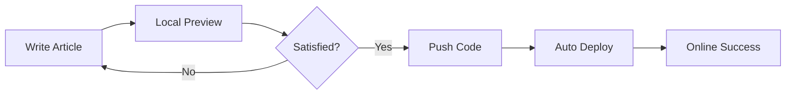
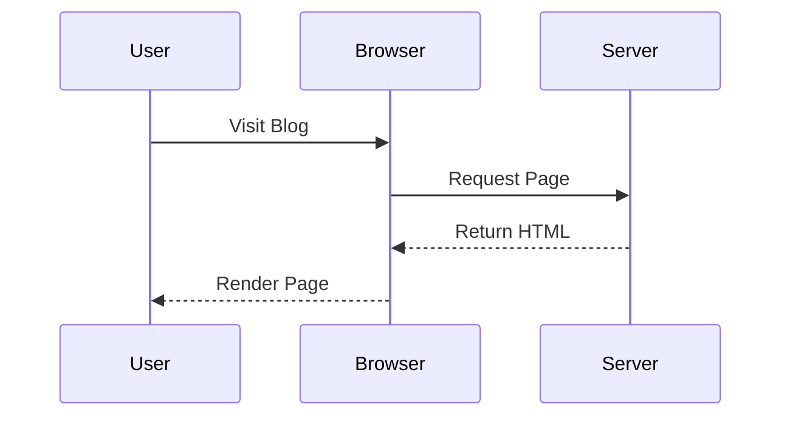
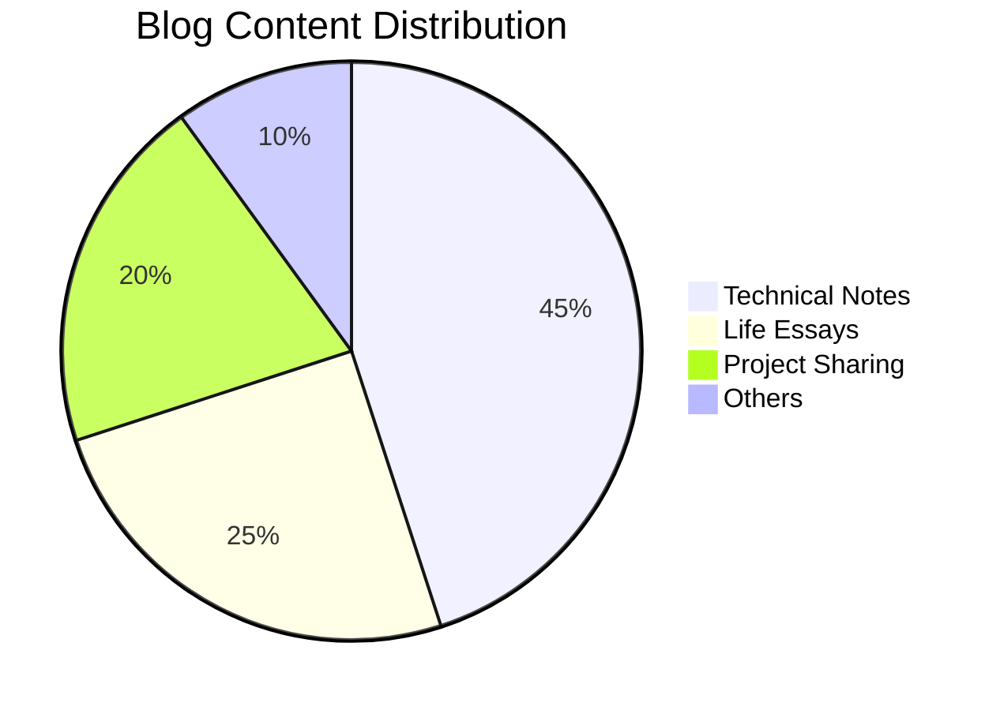

This article demonstrates all Markdown enhanced features supported by astro-koharu.

## Link Embedding

astro-koharu supports automatic embedding of standalone links, including Tweets and general link previews.

### Tweet Embed Test

The following is a standalone Twitter link, which should automatically convert to a Tweet component:

https://twitter.com/vercel_dev/status/1997059920936775706

This is a link in a normal paragraph [Vercel Tweet](https://twitter.com/vercel_dev/status/1997059920936775706), and should not be embedded.

A Tweet using the new x.com domain:

https://x.com/vercel_dev/status/1997059920936775706

### General Link Preview Test

This is a link in a paragraph [react-tweet](https://github.com/vercel/react-tweet), and should not be embedded.

The following is a standalone regular link, which should display an OG preview card:

https://github.com/vercel/react-tweet

This is a link without OG image:

https://react-tweet.vercel.app/

This is a link that cannot fetch OG information:

https://zhuanlan.zhihu.com/p/1900483903984243480

### Codepen Link Embed

https://codepen.io/botteu/pen/YPKBrJX/

### Link Embedding Rules

- Standalone Twitter/X links automatically convert to Tweet components
- Standalone other links display OG preview cards
- Links within paragraphs remain unchanged
- Supports dark/light theme switching

## Code Highlighting

Syntax highlighting for multiple programming languages, automatically adapting to theme switching.

### JavaScript

```javascript
function greet(name) {
  console.log(`Hello, ${name}!`);
  return {
    message: "Welcome to astro-koharu",
    timestamp: Date.now(),
  };
}

greet("World");
```

### TypeScript

```typescript
interface BlogPost {
  title: string;
  date: Date;
  tags: string[];
  content: string;
}

const post: BlogPost = {
  title: "My First Post",
  date: new Date(),
  tags: ["astro", "blog"],
  content: "Hello World!",
};
```

### Python

```python
def fibonacci(n: int) -> list[int]:
    """Generate Fibonacci sequence"""
    if n <= 0:
        return []
    elif n == 1:
        return [0]

    fib = [0, 1]
    for i in range(2, n):
        fib.append(fib[i-1] + fib[i-2])
    return fib

print(fibonacci(10))
```

### Bash

```bash
#!/bin/bash
# Start development server
pnpm install
pnpm dev

echo "Server is running at http://localhost:4321"
```

## GFM Tables

| Feature     | Support Status | Description |
| :--------- | :------------: | ----------: |
| Tables |       ✅ | Supports alignment |
| Task Lists |       ✅       | Checkboxes |
| Strikethrough |    ✅       | ~~Deleted text~~ |
| Auto Links |       ✅       | Auto URL recognition |

## Task Lists

- [x] Install astro-koharu
- [x] Configure site info
- [ ] Write your first article
- [ ] Deploy to Vercel

## Mermaid Diagrams

### Flowchart



### Sequence Diagram



### Pie Chart



## Text Styles

- **Bold text**
- _Italic text_
- ~~Strikethrough~~
- `Inline code`
- [Link text](https://github.com/cosZone/astro-koharu)

## Blockquotes

> This is a blockquote.
>
> astro-koharu makes blog building simple and elegant.

## Heading Levels

This article demonstrates h2-h6 headings at all levels, each automatically generates an anchor link for easy sharing and referencing.

### Level 3 Heading

#### Level 4 Heading

##### Level 5 Heading

###### Level 6 Heading

## Horizontal Rule

---

## Lists

### Unordered Lists

- Item 1
  - Sub-item A
  - Sub-item B
- Item 2
- Item 3

### Ordered Lists

1. First step
2. Second step
   1. Sub-step A
   2. Sub-step B
      1. Sub-step C
3. Third step

## Images

Images automatically apply LQIP (Low Quality Image Placeholder) effect:


## Shoka-Compatible Markdown Syntax

In addition to the standard Markdown enhancements above, astro-koharu also supports rich extended syntax migrated from the Hexo Shoka theme, including:

- **Text Effects** -- Underline ++ins++, Highlight ==mark==, Subscript/superscript ~sub~ / ^sup^, Colored text
- **Hidden Text** -- Spoiler particle animation !!hidden text!! and !!blur effect!!{.blur}
- **Ruby Annotations** -- Ruby {漢字^かんじ}
- **Container Blocks** -- Note blocks `:::info`, Collapse blocks `+++primary title`, Tab cards `;;;tab`
- **Friend Link Cards** -- `` YAML data rendered as interactive cards
- **Audio/Video Player** -- `` supports NetEase Cloud Music/QQ Music playlists
- **Math Formulas** -- KaTeX inline $E=mc^2$ and block-level `$$...$$`
- **Code Block Enhancement** -- title, mark line highlighting, command prompt
- **Quiz System** -- Four question types: single choice, multiple choice, true/false, fill-in-the-blank
- **Encrypted Content Block** -- `:::encrypted{password="..."}` AES-256-GCM encryption to prevent search engine crawling

All features can be independently toggled in `config/site.yaml`. For complete syntax demos and usage, refer to [Shoka Theme Markdown Syntax Demo](/post/note/shoka-features).

## Encrypted Content Block

Use the `:::encrypted{password="password"}` syntax to create encrypted blocks. Content is truly encrypted using AES-256-GCM at build time, and the password does not appear in the final HTML, effectively preventing search engines and crawlers from indexing sensitive content.

Markdown inside encrypted blocks receives the same rendering treatment as regular content (Shiki code highlighting, KaTeX formulas, etc.), and is displayed directly after decryption.

> True encryption cannot be achieved on the frontend because the password must be entered client-side, making ciphertext and algorithms visible to users, and security entirely depends on password strength. The purpose of this feature is **to prevent search engines and crawlers from directly indexing plaintext content**, rather than resisting targeted attacks.

````markdown
:::encrypted{password="demo"}
This content is encrypted. Enter the password `demo` to view it.

Supports **full Markdown syntax**, including code blocks:

```python
print("Hello from encrypted block!")
```
:::
````

:::encrypted{password="demo"}
This content is encrypted. Enter the password `demo` to view it.

Supports **full Markdown syntax**, including code blocks:

```python
print("Hello from encrypted block!")
```
:::

## Summary

The above demonstrates the main Markdown features supported by astro-koharu. For more features, please refer to the [Usage Guide](/post/astro-koharu-guide).