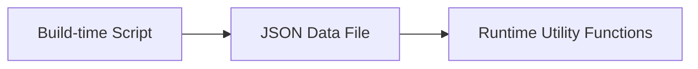

A complete usage guide for the astro-koharu blog system to help you get started quickly and make the most of all features.

https://github.com/cosZone/astro-koharu

## Quick Start

### Project Introduction

astro-koharu is a modern blog system built on Astro 5.x, migrated from Hexo, with design inspiration and original intent from the [Shoka](https://github.com/amehime/hexo-theme-shoka) theme. Feel free to [fork](https://github.com/cosZone/astro-koharu/fork) it to create your own theme.

**Core Features:**

- Built on Astro 5.x, static site generation, excellent performance
- Elegant dark/light theme switching
- Backend-free full-site search based on Pagefind
- Complete Markdown enhancements (GFM, code highlighting, auto-generated TOC)
- Flexible multi-level category and tag system (migrated from Shoka theme, will consider making it toggleable)
- Multi-series article support (weekly, reading notes, etc. with custom URL slugs)
- Responsive design
- Draft and sticky post features
- Reading progress bar and reading time estimation
- Mobile article reading header
- Friend link system and archive page
- Multi-language support (i18n)
- RSS subscription support
- LQIP (Low Quality Image Placeholder)
- Christmas special (toggleable)

### Local Development

```bash
# Clone the project
git clone https://github.com/cosZone/astro-koharu.git
cd astro-koharu

# Install dependencies
pnpm install

# Start development server
pnpm dev

# Build for production
pnpm build

# Preview production build
pnpm preview
```

### Quick Deployment

One-click deployment with Vercel:

[](https://vercel.com/new/clone?repository-url=https://github.com/cosZone/astro-koharu&project-name=astro-koharu&repository-name=astro-koharu)

### Build Cache 说明

The project commits `.cache/og-data.json` to the Git repository. This file caches the OG metadata (title, description, image, etc.) fetched by the link embedding feature. Committing to Git allows Vercel, Netlify and other platforms to reuse it directly during builds without refetching each time, significantly speeding up builds.

Other files under `.cache/` (such as `transformers/` model cache, `summaries-cache.json`) are still ignored by `.gitignore` and will not be committed.

## Basic Configuration

### Site Configuration

Edit the `config/site.yaml` file to configure basic site information:

```yaml
# =============================================================================
# Site Basic Information
# =============================================================================
site:
  title: 余弦の博客 # Website title
  alternate: cosine # English short name (used as logo text)
  subtitle: WA 的一声就哭了 # Subtitle
  name: cos # Site author short name
  description: FE / ACG / 手工 / Dark Mode Obsessive / INFP # Site description
  avatar: /img/avatar.webp # Avatar path
  showLogo: true # Whether to show logo
  author: cos # Article author
  url: https://blog.cosine.ren/ # Site domain
  startYear: 2020 # Site creation year
  keywords: # SEO keywords
    - cos
    - cosine
    - 博客
    - 技术
    - 前端
```

### Local Light CMS Application

This project provides a standalone CMS management app with article management, in-browser editing, Markdown preview, and more.


**Start CMS:**

```bash
# First-time setup requires installing dependencies
pnpm cms:install

# Start CMS (default port 4322)
pnpm cms
```

CMS provides the following features:

- 📊 Article Dashboard: View article statistics, category distribution, recent updates
- 📝 In-browser Editor: Rich text editing based on BlockNote, supports Markdown
- 🔄 Draft/Publish Toggle: One-click switching of article status
- 📌 Sticky Management: Quickly sticky/unsticky articles
- ➕ New Article: Interactive article creation, auto-generates frontmatter

### Local Editor Jump

The edit button on article pages supports one-click jump to local editors (VS Code / Cursor / Zed, etc.).

**Configuration file:** `dev` section in `config/site.yaml`

```yaml
dev:
  localProjectPath: "/Users/yourname/path/to/astro-koharu" # Absolute path to local project
  contentRelativePath: "src/content/blog" # Blog content directory
  editors:
    - id: vscode
      name: VS Code
      icon: devicon-plain:vscode # Can search icons at https://icon-sets.iconify.design/
      urlTemplate: "vscode://file/{path}"
    - id: cursor
      name: Cursor
      icon: simple-icons:cursor
      urlTemplate: "cursor://file/{path}"
    - id: zed
      name: Zed
      icon: simple-icons:zedindustries
      urlTemplate: "zed://file/{path}"
```

**Configuration notes:**

- `localProjectPath` must be an absolute path on your machine, otherwise the correct file path cannot be generated
- `urlTemplate` supports `{path}` placeholder, which will be replaced with the complete file path
- After configuration, an edit button will appear on the article page, clicking it will open the file directly in your local editor

**Featured Category Configuration:**

Featured category cards displayed at the bottom of the homepage:

```yaml
featuredCategories:
  - link: life # Category link (corresponds to category_map)
    label: 随笔 # Display name
    image: /img/cover/2.webp # Cover image
    description: 生活记录、年度总结等 # Description
  - link: note/front-end
    label: 前端笔记
    image: /img/cover/1.webp
    description: 前端相关的笔记
  # ... more categories
```

**Multi-series Article Configuration:**

Configure featured series (such as weekly, reading notes, etc.), supporting multiple series, each series has its own page and custom URL:

```yaml
featuredSeries:
  - slug: weekly # URL path: /weekly (required, used as page route)
    categoryName: 周刊 # Category name (used to match articles)
    label: FE Bits # Display label
    fullName: FE Bits 前端周周谈 # Full name
    description: | # Description (supports multi-line)
      之前在自己的频道进行一些输出，于是有了这个周刊！
      更新时间期望是在每周天
    cover: /img/weekly_header.webp # Cover image
    enabled: true # Whether to enable
    icon: ri:newspaper-line # Navigation icon (optional)
    highlightOnHome: true # Whether to highlight latest article on homepage (optional, default true)
    links: # Related links
      github: https://github.com/your-username/your-repo
      rss: /rss.xml

  - slug: reading # URL path: /reading
    categoryName: 书摘
    label: 读书笔记
    fullName: 我的读书笔记
    description: 读书摘录与感悟
    cover: /img/reading_header.webp
    enabled: true
    highlightOnHome: false # This series is not highlighted on homepage
```

**Field Description:**

| Field | Required | Description |
| ----- | -------- | ----------- |
| `slug` | ✅ | URL path, e.g. `weekly` corresponds to `/weekly` |
| `categoryName` | ✅ | Category name, used to match articles |
| `label` | ❌ | Display label (defaults to categoryName) |
| `enabled` | ❌ | Whether to enable this series (default true) |
| `fullName` | ❌ | Full name (for page title) |
| `description` | ❌ | Series description |
| `cover` | ❌ | Cover image path |
| `icon` | ❌ | Navigation icon (Iconify format) |
| `highlightOnHome` | ❌ | Whether to highlight latest article on homepage (default true) |
| `links` | ❌ | Related links (github, rss, etc.) |

### Social Media Configuration

Configure social media links in `config/site.yaml`:

```yaml
social:
  github:
    url: https://github.com/your-username
    icon: ri:github-fill # Iconify icon name
    color: "#191717" # Theme color
  bilibili:
    url: https://space.bilibili.com/your-uid
    icon: ri:bilibili-fill
    color: "#da708a"
  email:
    url: mailto:your@email.com
    icon: ri:mail-line
    color: "#55acd5"
  rss:
    url: /rss.xml
    icon: ri:rss-line
    color: "#ff6600"
  # ... more platforms
```

Supported platforms: GitHub, Twitter, Bilibili, NetEase Cloud Music, Email, RSS, etc. See `config/site.yaml` for complete configuration.

### Navigation Configuration

Customize navigation menus in `config/site.yaml`:

```yaml
navigation:
  - name: 首页
    path: /
    icon: fa6-solid:house-chimney
  - name: 周刊
    path: /weekly # Corresponds to slug: weekly in featuredSeries
    icon: ri:newspaper-line
  - name: 读书笔记
    path: /reading # Corresponds to slug: reading in featuredSeries
    icon: ri:book-open-line
  - name: 文章
    icon: ri:quill-pen-ai-fill
    children: # Supports nested submenus
      - name: 分类
        path: /categories
        icon: ri:grid-fill
      - name: 标签
        path: /tags
        icon: fa6-solid:tags
      - name: 归档
        path: /archives
        icon: ri:archive-2-fill
  - name: 友链
    path: /friends
    icon: ri:links-line
  - name: 关于
    path: /about
    icon: fa6-regular:circle-user
```

> **Note**: Series page paths are in the format `/{slug}`, which must match the `slug` field configured in `featuredSeries`.

### Category Map Configuration

Configure Chinese category name to URL-friendly English slug mapping in `config/site.yaml`:

```yaml
# =============================================================================
# Category Map
# Maps Chinese category names to URL-friendly English slugs
# =============================================================================
categoryMap:
  # Primary categories
  随笔: life
  笔记: note
  工具: tools
  周刊: weekly # Used for category page /categories/weekly
  书摘: reading # Used for category page /categories/reading
  # Secondary categories (for nested paths)
  前端: front-end
  # Add more as needed:
  # 后端: back-end
  # 算法: algorithm
```

This way, the URL for the "随笔" category will be `/categories/life` instead of `/categories/随笔`.

> **Note**: `categoryMap` is only used for URL mapping of category pages (`/categories/*`). Series page URLs (such as `/weekly`, `/reading`) are separately configured by the `slug` field in `featuredSeries`.

## Article System

### Creating Articles

**Method 1: Use Koharu CLI (Recommended)**

Use the interactive CLI tool to quickly create articles:

```bash
pnpm koharu new post
```

The CLI tool will guide you through entering title, category, tags, and other information, automatically generating frontmatter and markdown files.

**Method 2: Manual Creation**

Create Markdown files in the `src/content/blog/` directory. The directory structure affects the article's category:

```plain
src/content/blog/
├── life/              # 随笔 category
│   └── 2024-life-review.md
├── note/
│   ├── front-end/     # 笔记 > 前端
│   │   └── react/
│   │       └── React学习小记.md
│   └── algorithm/     # 笔记 > 算法
│       └── 动态规划学习笔记.md
└── tools/             # 工具 category
    └── vscode插件推荐.md
```

### Frontmatter Field 说明

Each article needs a YAML frontmatter at the beginning:

**Required fields:**

```yaml
---
title: Article Title # Required
date: 2024-12-06 # Required, publication date
---
```

**Common optional fields:**

```yaml
---
title: Article Title
date: 2024-12-06
updated: 2024-12-15 # Last update time (optional, shown on article page when present)
description: Article summary description # Used for SEO and list display; if not set, AI summary or first 150 characters of body are used
link: custom-url-slug # Custom URL (defaults to filename)
cover: /img/cover/1.webp # Cover image
tags: # Tag list
  - JavaScript
  - React
categories: # Category (see detailed说明 below)
  - 笔记
subtitle: Subtitle # Article subtitle
catalog: true # Whether to show table of contents (default true)
tocNumbering: true # Whether to show TOC numbering (default true)
draft: false # Whether it's a draft (default false)
sticky: false # Whether to sticky (default false)
excludeFromSummary: false # Whether to exclude from AI summary and similarity calculation (default false, recommended for series articles)
math: false # Whether to enable math formula rendering (default false; when enabled, supports KaTeX)
quiz: false # Whether to enable quiz interactivity (default false; when enabled, supports four question types)
password: mySecret # Entire article encryption password (optional; when set, entire article requires password to read)
---
```

**About the description field:**

Article description priority: handwritten `description` > AI auto summary > first 150 characters of Markdown body

- It is recommended to write descriptions manually for important articles to get better SEO results
- If description is omitted, the system will automatically use AI-generated summary (requires running `pnpm generate:summaries`)
- If neither handwritten description nor AI summary exists, the first 150 characters of the article body are automatically extracted

**About the link field (Custom URL):**

⚠️ **Important**: The `link` field is **automatically converted to lowercase** to maintain URL consistency and standardization.

- **Normalization behavior**: Whether you input `MyPost`, `myPost` or `mypost`, the final URL will be `/post/mypost`
- **Filename case-insensitive**: Article filenames can use any case (such as `MyPost.md`), the system handles it automatically
- **AI summaries and similarity**: Keys in generated `summaries.json` and `similarities.json` are also normalized to lowercase
- **Best practice**: It is recommended to directly use lowercase and hyphens (such as `my-awesome-post`) to avoid confusion

```yaml
# ✅ Recommended写法
link: my-awesome-post  # URL: /post/my-awesome-post

# ⚠️ Will be converted to lowercase
link: MyAwesomePost    # URL: /post/myawesomepost (not /post/MyAwesomePost)
link: My-Awesome-Post  # URL: /post/my-awesome-post
```

If the `link` field is omitted, the system will use the filename (also converted to lowercase):

```yaml
# File: src/content/blog/MyPost.md
# Omit link field → URL: /post/mypost
```

### Category System

astro-koharu supports flexible category configuration:

**Single-level category:**

```yaml
categories:
  - 工具 # or ['工具']
```

Corresponding URL: `/categories/tools` (mapped according to `categoryMap`)

**Multi-level nested category:**

```yaml
categories:
  - [笔记, 前端, React]
```

This creates a hierarchical relationship: 笔记 -> 前端 -> React

Corresponding URL: `/categories/note/front-end/react`

### Tag System

Tags are flat and do not support hierarchy:

```yaml
tags:
  - JavaScript
  - TypeScript
  - 学习笔记
```

All tags are displayed on the `/tags` page; click a tag to view all articles under that tag.

### Draft Feature

Set `draft: true` to mark an article as a draft:

```yaml
---
title: Unfinished Article
draft: true
---
```

**Behavior:**

- **Local development** (`pnpm dev`): Drafts are visible, article cards show "DRAFT" badge in the upper right corner
- **Production build** (`pnpm build`): Drafts are automatically filtered and won't appear in any lists

### Sticky Feature

Set `sticky: true` to sticky an article:

```yaml
---
title: Important Announcement
sticky: true
---
```

**Behavior:**

- Sticky articles are displayed in the "Sticky Articles" area on the homepage
- Sticky articles are sorted by date (newest first)
- Does not affect sorting on other pages (category, tag, archive)

### Series Articles

Articles under a series configured with `featuredSeries` will:

1. Have a dedicated series page (URL determined by `slug`, such as `/weekly`, `/reading`)
2. Not appear in the regular article list (`/posts`)
3. If the series has `highlightOnHome: true`, the latest one will be highlighted on the homepage

**Example:**

```yaml
---
title: FE Bits Vol.16
categories:
  - 周刊 # Corresponds to categoryName of a certain featuredSeries
excludeFromSummary: true # Optional: exclude from AI summary generation
---
```

```yaml
---
title: 《Code Complete》Reading Notes
categories:
  - 书摘 # Corresponds to categoryName of another featuredSeries
---
```

> **Tip**: The article's `categories` field needs to match the `categoryName` of a series in `featuredSeries` to be included in that series.

### Standalone Pages

In addition to blog articles, you can add standalone pages (such as "About", "Playlist", etc.) by creating `.md` files in the `src/pages/` directory. These pages use the `PageLayout.astro` layout and support complete Markdown enhancement syntax.

**Creating Standalone Pages:**

Create a new `.md` file in the `src/pages/` directory:

```markdown
---
layout: ../layouts/PageLayout.astro
title: "Playlist"
description: "My favorite music"
coverTitle: "My Playlist"
comments: false
---

Page content...
```

**Frontmatter Fields:**

| Field | Required | Description |
| ----- | -------- | ----------- |
| `layout` | ✅ | Fixed to `../layouts/PageLayout.astro` |
| `title` | ✅ | Page title (for browser tab) |
| `description` | ❌ | Page description (for SEO) |
| `coverTitle` | ❌ | Title displayed on cover (defaults to `title`) |
| `comments` | ❌ | Whether to show comments section (default `true`) |

**Adding Navigation Entries:**

Add corresponding menu items in `navigation` in `config/site.yaml`:

```yaml
navigation:
  # ...
  - name: Playlist
    path: /music
    icon: ri:music-2-fill
```

> **Tip**: All `.md` files under `src/pages/` are automatically overwritten by the Koharu CLI's backup feature, no additional configuration needed.

## Interface Features

### Theme Switching

Click the sun/moon icon in the upper right corner to switch between dark/light mode.

**Code Highlighting:**

- Light mode: `github-light`
- Dark mode: `github-dark`

### Full-site Search

Static site search based on [Pagefind](https://pagefind.app/), no backend server required.

**Open Search:**

- Click the search icon in the navigation bar
- Shortcut: `Cmd/Ctrl + K`

**Features:**

- Supports Chinese word segmentation
- Real-time search results
- Highlight matching keywords
- Shows article summary and metadata

### Article Reading Features

**Table of Contents (TOC):**

- Automatically extracts article headings (h2-h6) to generate a table of contents
- Uses CSS counters to automatically add hierarchical numbering to headings (such as 1., 1.1., 1.1.1.)
- Supports closing numbering display via the `tocNumbering: false` field in frontmatter
- Click any TOC entry to jump to the corresponding section
- Automatically highlights the current section while scrolling
- Displayed in the right sidebar on desktop, collapsed on mobile

**TOC Numbering Control:**

```yaml
---
title: My Article
tocNumbering: false # Close TOC numbering (default is true)
---
```

- By default, all articles' tables of contents display hierarchical numbering
- Setting `tocNumbering: false` closes numbering for specific articles
- Numbering is implemented via CSS counters, zero runtime overhead
- Simultaneously applies to both desktop sidebar and mobile dropdown table of contents

**Reading Progress Bar:**

- Displays reading progress at the top of the page
- Real-time updates current reading position

**Heading Anchor Links:**

- Each heading automatically generates an ID
- Hovering over a heading shows a `#` link icon
- Click to copy the URL with anchor

**Series Article Navigation:**

The bottom of an article shows the previous/next article in the same series:

- Automatically grouped based on the deepest category
- Sorted by publication date
- Shows article title and cover

**Reading Time Estimation:**

Article cards display estimated reading time (calculated based on word count).

**Mobile Article Reading Header:**

When browsing articles on mobile (≤992px), the top navigation bar displays a reading-optimized header:

- **Circular Reading Progress** - A circular progress bar showing real-time reading progress
- **Current Section Title** - Shows the current H2/H3 section heading, with smooth animations when switching
- **Expandable Table of Contents** - Clicking the title area expands the full article table of contents for quick jumping to any section

Features:

- Automatically updates current section while scrolling
- Supports `prefers-reduced-motion` to reduce animations

### Responsive Design

**Desktop:**

- Two-column layout (main content + sidebar)
- Fixed navigation bar
- Floating table of contents

**Tablet:**

- Adaptive layout adjustment
- Simplified sidebar

**Mobile:**

- Single-column layout
- Drawer-style navigation menu (hamburger menu)
- Collapsible table of contents
- Touch-optimized interactions
- Article page-specific reading header (progress circle + current title + expandable TOC)

## Special Features

### Series Article System

`featuredSeries` supports configuring multiple series, each series automatically generates an independent page:

**Dedicated Series Page** (`/{slug}`):

- Each enabled series has an independent page (such as `/weekly`, `/reading`)
- Displays all articles in that series
- Series header image and introduction
- Related links (GitHub, RSS, etc.)

**Homepage Display:**

- Series with `highlightOnHome: true` have their latest article highlighted on the homepage
- Series with `highlightOnHome: false` are not displayed on the homepage
- All series articles are independent from regular article lists

> 💡 **Design 说明: Separation of Concerns**
>
> The design goal of featuredSeries is **to separate high-output categories from the homepage**, preventing the homepage from being flooded by a single type of article. Applicable scenarios:
>
> - **Weekly/Diary**: Frequent updates, large quantity
> - **Reading Notes**: Form a separate series for convenient browsing by series
> - **Any category with many articles**: When a certain category far exceeds other categories in article count
>
> **Homepage Behavior:**
>
> - Series articles are excluded from the homepage main list
> - When `highlightOnHome: true` is set, the latest article is highlighted at the top of the homepage
> - Other articles are accessed through the series' dedicated page (such as `/weekly`)
>
> **Other Pages Display Normally**: Series articles are still displayed together with regular articles on archive, category, tag, search, and other pages; only the homepage main list is separated.

**Configuration Example:**

```yaml
featuredSeries:
  - slug: weekly
    categoryName: 周刊
    highlightOnHome: true # Display latest weekly on homepage
    # ...
  - slug: reading
    categoryName: 书摘
    highlightOnHome: false # Not displayed on homepage
    # ...
```

### Archive Page

Visit `/archives` to view the archive view of all articles:

- Grouped by year
- Shows article count per year
- Timeline-style display
- Includes article publication date, title, category

### Friend Link System

Visit `/friends` to view the friend links page:

**Features:**

- Friend link card display
- Friend link application form (customizable)
- Supports avatar, name, description, link

### LQIP (Low Quality Image Placeholder)

LQIP is an image loading optimization technique that displays a low-quality placeholder before the high-definition image loads, avoiding blank spaces or layout shifts.

**Features:**

- 🎨 Automatically extracts the main color of images at build time, generating CSS gradient placeholders
- ⚡ Zero runtime overhead —— Pure CSS implementation, no JavaScript decoding required
- 📦 Extremely small data size —— Only 18 characters per image
- 🔄 External images automatically degrade to solid color placeholders

**Supported Components:**

- Article card cover (`PostItemCard`)
- Page banner (`Cover`)
- Category card background (`CategoryCards`)
- Series cover (`SeriesCover`)
- Sidebar avatar (`HomeInfo`)

**Usage:**

```bash
# Generate LQIP data (processes all images under public/img/)
pnpm generate:lqips
```

**Generation Effect:**

LQIP data is saved in `src/assets/lqips.json`, format as follows:

```json
{
  "cover/1.webp": "87a3c4c2dfefbddae9",
  "cover/2.webp": "6e3b38ae7472af7574"
}
```

Each value is 18 hex characters (3 colors), decoded at runtime into CSS gradients:

```css
linear-gradient(135deg, #87a3c4 0%, #c2dfef 50%, #bddae9 100%)
```

**Principle:**

1. Use sharp to scale images to 2×2 pixels
2. Extract average colors of four quadrants (top-left, top-right, bottom-left, bottom-right)
3. Select 3 colors to generate a 135-degree diagonal gradient
4. Store as compact hex strings

**Usage in Components:**

```astro
---
import { getLqipStyle, getLqipProps } from '@lib/lqip';

// Method 1: Get style string directly
const style = getLqipStyle('/img/cover/1.webp');
// Returns: "background-image:linear-gradient(...)"

// Method 2: Get complete props (supports external image degradation)
const lqipProps = getLqipProps(coverUrl);
// Local image returns: { style: "background-image:..." }
// External image returns: { class: "lqip-fallback" }
---

<div style={style}>
  
</div>
```

**Notes:**

- Generated `src/assets/lqips.json` needs to be committed to git
- Need to re-run `pnpm generate:lqips` after adding new images
- External images (starting with http/https) automatically degrade to solid color placeholders

### Related Articles Recommendation

Reference [No Server, No Database: Smarter Related Posts in Astro with `transformers.js`](https://alexop.dev/posts/semantic-related-posts-astro-transformersjs/)

A smart article recommendation system based on semantic similarity, using [transformers.js](https://huggingface.co/docs/transformers.js) to generate article embedding vectors locally and calculate semantic similarity between articles.

**Features:**

- 🧠 AI embedding model-based semantic understanding (Snowflake Arctic Embed)
- 📊 Automatically calculates similarity between articles, recommends5 most relevant articles
- 🚀 Pre-computed at build time, zero runtime overhead
- 🔧 Supports excluding specific articles via frontmatter

**Usage:**

```bash
# Generate similarity data (runs locally, automatically downloads model, takes about 3-5 minutes)
pnpm generate:similarities

# Generated files are committed to git, used directly on Vercel and other platforms
```

**Excluding Specific Articles:**

Set `excludeFromSummary: true` in article frontmatter to exclude that article:

```yaml
---
title: Weekly Issue 1
excludeFromSummary: true # Exclude this article from similarity calculation and AI summary generation
---
```

> **Tip**: Series articles (such as weekly) usually should set `excludeFromSummary: true` to avoid affecting the recommendation quality of other articles.

**Content Configuration:**

You can choose whether to include the article body in similarity calculation:

```typescript
// true: Use Title + Description + Body (more accurate, slower)
// false: Use only Title + Description (faster, suitable for blogs with many articles)
const INCLUDE_BODY = true;
```

- **Include body**: Similarity is more precise, can identify content-level relevance, but generation is slower
- **Title + Description only**: Faster generation, suitable for blogs with detailed descriptions

```bash
# Time to compute similarity for 168 articles (title + description) using Snowflake/snowflake-arctic-embed-m-v2.0
Done! Generated similarities for 168 posts in 4.1s

# Time to compute similarity for 168 articles (title + description + body) using Snowflake/snowflake-arctic-embed-m-v2.0
Done! Generated similarities for 168 posts in 219.3s
```

The difference is quite significant, but I personally like the results with body included, the effect is obviously better. So I decided to add an AI summary feature as well.

**Model Selection:**

Defaults to `Snowflake/snowflake-arctic-embed-m-v2.0` model:

- **Model size**: About 90MB (automatically downloaded to `.cache/transformers` directory on first run)
- **Vector dimensions**: 768 dimensions
- **Performance**: Balances quality and speed, suitable for Chinese and English content
- **Generation time**: About 3-5 minutes (169 articles)

To change the model, edit `MODEL_NAME` in `src/scripts/generateSimilarities.ts`:

```typescript
const MODEL_NAME = "Snowflake/snowflake-arctic-embed-m-v2.0";
// Optional alternatives:
// const MODEL_NAME = 'sentence-transformers/all-MiniLM-L6-v2'; // Smaller and faster (~23MB), 384 dimensions
// const MODEL_NAME = 'BAAI/bge-small-zh-v1.5';  // Chinese-optimized
```

**Comparison of Other Optional Models:**

| Model | Size | Dimensions | Advantage |
| ----- | ---- | ---------- | --------- |
| `Snowflake/snowflake-arctic-embed-m-v2.0` | ~90MB | 768 | High quality, balanced for Chinese and English |
| `sentence-transformers/all-MiniLM-L6-v2` | ~23MB | 384 | Lightweight and fast |
| `BAAI/bge-small-zh-v1.5` | ~95MB | 512 | Chinese-specific |

**Notes:**

- Needs to run the generation script locally (models cannot run on Vercel and other platforms)
- Generated `src/assets/similarities.json` needs to be committed to git
- If similarity file is not generated, the related articles module will not be displayed
- Model files are cached in `.cache/transformers` directory (already added to `.gitignore`)

### AI Auto Summary

An intelligent summary generation system based on [transformers.js](https://huggingface.co/docs/transformers.js), using advanced AI models to automatically generate high-quality summaries for articles.

**Relationship with Related Articles Recommendation:**

AI summary feature and related articles recommendation feature complement each other:

- **Similarity calculation** needs to read the full article text, with higher computational cost (about 3-5 minutes)
- **AI summary** provides quality descriptions without reading the full text, and the generated summary can also help improve the effect of similarity calculation
- Both share the same model caching mechanism, saving storage space

**Features:**

- 🤖 Based on advanced text generation model (Xenova/LaMini-Flan-T5-783M)
- 📝 Automatically generates summaries for articles without descriptions
- ✨ Article detail page supports typewriter animation display, enhancing reading experience
- 🎯 Intelligent fallback: prioritizes handwritten description, automatically uses AI summary when no description
- 🚀 Pre-generated at build time, zero runtime overhead
- ♿ Supports accessibility and prefers-reduced-motion

**Usage:**

```bash
# Generate AI summaries (runs locally, downloads model on first run, takes about 5-10 minutes)
pnpm generate:summaries

# Generated files should be committed to git, then can be used directly on Vercel and other platforms
```

**Generation Effect:**

AI summaries are saved in `src/assets/summaries.json` file, format as follows:

```json
{
  "article-slug": {
    "title": "Article Title",
    "summary": "AI-generated summary content..."
  }
}
```

**Where It's Used:**

1. **Article Detail Page**: A collapsible AI summary card displayed below the breadcrumb navigation

   - Collapsed by default, click "Expand" button to trigger
   - After expansion, the summary content is displayed word by word with typewriter animation
   - Typewriter animation plays only once, supports `prefers-reduced-motion` user preference

2. **Article Cards**: Used as description fallback
   - Priority: handwritten `description` > AI summary > first 150 characters of Markdown
   - Automatically used in article lists, homepage, category pages, etc.

**Model Selection:**

Defaults to `Xenova/LaMini-Flan-T5-783M` model:

- **Model size**: About 300MB (automatically downloaded to `.cache/transformers` directory on first run)
- **Generation quality**: High-quality Chinese and English summary generation
- **Generation time**: About 5-10 minutes (169 articles)

To change the model, edit `MODEL_NAME` in `src/scripts/generateSummaries.ts`:

```typescript
const MODEL_NAME = "Xenova/LaMini-Flan-T5-783M";
// Optional alternatives:
// const MODEL_NAME = 'Xenova/distilbart-cnn-6-6'; // Faster, better results in English
// const MODEL_NAME = 'facebook/bart-large-cnn';   // Higher quality but slower
```

**Configuration Prompt:**

You can customize the prompt for generating summaries by editing `PROMPT_TEMPLATE` in `src/scripts/generateSummaries.ts`:

```typescript
const PROMPT_TEMPLATE = (title: string, content: string) =>
  `Please generate a concise summary (100-150 characters) for the following article:\n\nTitle：${title}\n\nContent：${content}`;
```

**Notes:**

- Needs to run the generation script locally (large models cannot run on Vercel and other platforms)
- Generated `src/assets/summaries.json` needs to be committed to git
- If summary file is not generated, it automatically falls back to Markdown text extraction
- Model files are cached in `.cache/transformers` directory (already added to `.gitignore`)
- First run needs to download the model; recommended in a good network environment

**Best Practices:**

1. **Use together with similarity calculation**:

   ```bash
   # Generate summaries first
   pnpm generate:summaries
   # Then calculate similarity (can use summary instead of full text to improve speed)
   pnpm generate:similarities
   ```

2. **Selective generation**: To save time, the script skips articles that already have `description`

3. **Commit to version control**: Commit the generated JSON file to git to avoid regenerating in CI/CD environments

### Christmas Special

A holiday-limited Christmas atmosphere special effects system, containing multiple independently toggleable visual effects to add festive atmosphere to the blog.

**Features:**

- Snowfall —— Snowflake animation implemented with Canvas, with foreground and background layers, supports parallax effect
- Christmas color scheme —— Red, green, and gold theme color replacement for default pink-blue color scheme, supports dark/light mode
- Christmas hat decoration —— Christmas hat on sidebar avatar
- Christmas light string —— Decorative light string animation at the top of the Header
- Christmas ornament toggle —— Decorative ornaments on the navigation bar
- Runtime toggle —— Floating button in the lower right corner can switch special effects anytime, settings auto-save

**Configuration Method:**

Edit the `christmas` configuration in `config/site.yaml`:

```yaml
christmas:
  enabled: true # Master switch
  features:
    snowfall: true # Snowfall
    christmasColorScheme: true # Christmas color scheme
    christmasCoverDecoration: true # Light string decoration
    christmasHat: true # Christmas hat
    readingTimeSnow: true # Reading time snowflake special effect
  snowfall:
    speed: 0.5 # Fall speed (default 0.5)
    intensity: 0.7 # Desktop snow density (0-1)
    mobileIntensity: 0.4 # Mobile snow density (0-1)
    maxLayers: 6 # Maximum snowflake layers
    maxIterations: 8 # Maximum iterations
    mobileMaxLayers: 4 # Maximum mobile layers
    mobileMaxIterations: 6 # Maximum mobile iterations
```

**User Control:**

- Floating button (snowflake icon) in the lower right corner can toggle Christmas special effects
- User preferences automatically saved to localStorage, persisted across sessions
- Supports `prefers-reduced-motion` preference, automatically disables animations

**Technical Implementation:**

- Snowflakes use Canvas 2D rendering, layered for parallax effect
- Color scheme via CSS variable overrides, zero runtime overhead
- State management uses nanostores, supports cross-component synchronization
- Fully responsive, mobile automatically reduces snowflake density

**Turn Off Christmas Special:**

Set `christmasConfig.enabled = false` to completely turn off all Christmas special effects.

### Site Announcement System

A backend-free site announcement system, supporting announcement management in configuration files, automatically pops up on first visit, can be viewed again via footer entry after closing.

**Features:**

- Backend-free —— Announcement content written in configuration file, no database needed
- Toast notification —— Floating notification in lower right corner, supports stacking multiple notifications
- Multiple announcements —— Supports configuring multiple announcements, sorted by priority
- Time control —— Supports setting announcement start/end dates, automatic display control
- Custom colors —— Each announcement can set an independent color, overriding default type color
- Timeline popup —— Announcement list uses timeline style, with gradient connecting lines
- Hover to mark as read —— Automatically marks as read after hovering on Toast for 1 second
- Read tracking —— localStorage records read status, returning visitors don't see repeated popups
- View again —— Footer entry can view all announcements anytime, shows unread red dot indicator

**Configuration Method:**

Edit `config/site.yaml` to add announcements:

```yaml
announcements:
  - id: welcome-2026 # Unique identifier
    title: Happy New Year 2026! # Announcement title
    content: Happy New Year! Thanks for your continued support~ # Announcement content
    type: info # Type: info | warning | success | important
    priority: 300 # Priority (higher displays first)
    color: "#ED788C" # Custom color (optional, overrides default color for type)
    publishDate: "2026-01-01" # Display date (optional, used in timeline display)
    startDate: "2025-12-31T00:00:00+08:00" # Start date (optional)
    endDate: "2026-01-15T23:59:59+08:00" # End date (optional)
  - id: site-update-01
    title: Site Update Announcement
    content: New site announcement system, now supports displaying multiple announcements simultaneously!
    type: info
    priority: 500
    color: "#6366F1"
    publishDate: "2025-01-02"
```

To add a link (optional):

```yaml
announcements:
  - id: example-with-link
    title: Example Announcement
    content: Announcement content
    type: info
    link:
      url: https://example.com
      text: Learn more
      external: true
```

**Announcement Type Styles:**

| Type | Description | Default Color |
| ---- | ----------- | ------------- |
| `info` | Information notification | Blue (#3b82f6) |
| `warning` | Warning notice | Yellow (#eab308) |
| `success` | Success message | Green (#22c55e) |
| `important` | Important announcement | Red (#ef4444) |

> Set `color` field to override the above default colors

**Interaction Flow:**

1. **First visit**: Automatically pops up unread announcement Toast after 0.5 seconds (multiple stacked display)
2. **Hover to mark as read**: Automatically marks as read after hovering on Toast for 1 second
3. **Manual dismiss**: Click Dismiss to close Toast
4. **Click "View all"**: Closes all Toasts, opens timeline popup
5. **Timeline popup**: Click announcement card to mark as read, displays publication date and gradient connecting line
6. **Footer entry**: Can click anytime to view all announcements, shows red dot for unread
7. **Return visit**: Only displays truly unread announcements

**Notes:**

- Announcement `id` must be unique, used for tracking read status
- Omitting `startDate` means effective immediately, omitting `endDate` means never expires
- `publishDate` is used for date display in timeline popup; if omitted, uses `startDate`
- Expired announcements are recommended to be deleted from configuration to keep it clean
- Read status is stored in localStorage, key is `announcement-read-ids`

### Markdown Enhancement

**Syntax Support:**

- GitHub Flavored Markdown (GFM)
  - Tables
  - Task lists
  - Strikethrough
  - Auto links

**Mermaid Diagrams:**

Supports using Mermaid syntax in Markdown to draw flowcharts, sequence diagrams, architecture diagrams, etc.

````markdown

````


Supported diagram types:

- `flowchart` / `graph` - Flowchart
- `sequenceDiagram` - Sequence diagram
- `classDiagram` - Class diagram
- `stateDiagram` - State diagram
- `erDiagram` - ER diagram
- `gantt` - Gantt chart
- `pie` - Pie chart
- `mindmap` - Mind map

Diagrams automatically adapt to dark/light theme switching. For more syntax, refer to [Mermaid Official Documentation](https://mermaid.js.org/).

**Infographic:**

Supports using [@antv/infographic](https://infographic.antv.vision/) to draw beautiful infographics in Markdown, suitable for displaying processes, comparisons, hierarchies, statistics, and other data.

Usage: Use the `infographic` directive in a code block, specify the template name on the first line, then define data in a YAML-like syntax:

````markdown
```infographic
infographic list-grid-badge-card
data
  title Tech Stack
  desc My Common Tech Stack
  items
    - label TypeScript
      desc Type-safe JavaScript
      icon mdi/language-typescript
    - label React
      desc User Interface Library
      icon mdi/react
    - label Astro
      desc Modern Static Site Generator
      icon mdi/rocket-launch
```
````

```infographic
infographic list-grid-badge-card
data
  title Tech Stack
  desc My Common Tech Stack
  items
    - label TypeScript
      desc Type-safe JavaScript
      icon mdi/language-typescript
    - label React
      desc User Interface Library
      icon mdi/react
    - label Astro
      desc Modern Static Site Generator
      icon mdi/rocket-launch
```

**Available Template Types:**

- **List type** (`list-*`): Display information lists

  - `list-grid-badge-card` - Card grid layout
  - `list-grid-candy-card-lite` - Candy style cards
  - `list-row-horizontal-icon-arrow` - Horizontal icon arrow list

- **Process/Sequence type** (`sequence-*`): Display steps, processes, or stages

  - `sequence-zigzag-steps-underline-text` - Zigzag steps
  - `sequence-circular-simple` - Circular process
  - `sequence-roadmap-vertical-simple` - Vertical roadmap
  - `sequence-pyramid-simple` - Pyramid structure

- **Comparison type** (`compare-*`): Binary or multiple comparison

  - `compare-binary-horizontal-simple-fold` - Horizontal binary comparison
  - `compare-swot` - SWOT analysis
  - `compare-hierarchy-left-right-circle-node-pill-badge` - Hierarchical left-right comparison

- **Hierarchy type** (`hierarchy-*`): Display tree structures

  - `hierarchy-tree-tech-style-capsule-item` - Tech style tree diagram
  - `hierarchy-tree-curved-line-rounded-rect-node` - Curved connection tree diagram

- **Chart type** (`chart-*`): Data visualization

  - `chart-column-simple` - Column chart
  - `chart-bar-plain-text` - Bar chart
  - `chart-pie-plain-text` - Pie chart
  - `chart-line-plain-text` - Line chart

- **Other**
  - `quadrant-*` - Quadrant analysis diagram
  - `relation-*` - Relation diagram

**Data Field 说明:**

- `title` - Title (optional)
- `desc` - Description text (optional)
- `items` - Item array, each item can contain:
  - `label` - Main label text
  - `value` - Value (for chart-type templates)
  - `desc` - Description text
  - `icon` - Icon name (format: `mdi/icon-name`)
  - `children` - Sub-items (for hierarchical structures)

**Theme Customization:**

You can add a `theme` block after data to customize colors:

````markdown
```infographic
infographic sequence-pyramid-simple
data
  items
    - label Base Layer
    - label Middle Layer
    - label Top Layer
theme
  palette
    - #3b82f6
    - #8b5cf6
    - #f97316
```
````

Infographics automatically adapt to dark/light theme switching, and use the project's font rendering. For more templates and syntax, refer to [Infographic Official Documentation](https://infographic.antv.vision/).

**Code Highlighting:**

- Based on Shiki
- Supports dual themes (dark/light)
- Supports language annotations
- Line number display

Example:

````markdown
```javascript
function hello() {
  console.log("Hello, world!");
}
```
````

```javascript
function hello() {
  console.log("Hello, world!");
}
```

**Automatic Heading Links:**

All headings automatically generate clickable anchor links.

**Automatic Link Embedding:**

Standalone special links are automatically converted to embedded components:

- **Twitter/X links**: Automatically embed Tweet component
- **CodePen links**: Automatically embed interactive CodePen demo
- **Other links**: Display OG preview card (containing title, description, image, etc.)

Example:

```markdown
<!-- Standalone links will be embedded -->

https://x.com/vercel_dev/status/1997059920936775706

https://codepen.io/botteu/pen/YPKBrJX/

https://github.com/vercel/react-tweet

Links with strict anti-scraping, cannot fetch metadata

https://zhuanlan.zhihu.com/p/1900483903984243480

<!-- Links in paragraphs remain unchanged -->

This is a [regular link](https://example.com), will not be embedded.
```

https://x.com/vercel_dev/status/1997059920936775706

https://codepen.io/botteu/pen/YPKBrJX/

https://github.com/vercel/react-tweet

Links with strict anti-scraping, cannot fetch metadata

https://zhuanlan.zhihu.com/p/1900483903984243480

<!-- Links in paragraphs remain unchanged -->

This is a [regular link](https://example.com), will not be embedded.

**Shoka-Compatible Markdown Syntax:**

astro-koharu migrated a rich set of Markdown extended syntax from the Hexo Shoka theme, all features can be independently toggled via the `content` configuration in `config/site.yaml`.

*Text Effects (`enableShokaEffects`):*

Supports multiple inline text decoration effects:

| Syntax | Effect | Description |
| ------ | ------ | ----------- |
| `++text++` | Underline | `<ins>` tag |
| `++text++{.wavy}` | Wavy underline | Supports `.wavy` modifier |
| `++text++{.dot}` | Dotted emphasis | Supports `.dot` modifier |
| `++text++{.primary}` | Colored underline | Supports `.primary` `.success` `.warning` `.danger` `.info` |
| `==text==` | Highlight | `<mark>` tag |
| `~text~` | Subscript | `<sub>` tag, e.g. H~2~O |
| `^text^` | Superscript | `<sup>` tag, e.g. E=mc^2^ |

Example effects:

++This is underlined text++ ++Wavy underline++{.wavy} ++Dotted emphasis++{.dot}

++Primary++{.primary} ++Success++{.success} ++Warning++{.warning} ++Danger++{.danger} ++Info++{.info}

==This is highlighted text==

H~2~O is the chemical formula for water, E = mc^2^ is the mass-energy equivalence

*Colored Text and Special Styles (`enableShokaAttrs`):*

Use `[text]{.class}` syntax to add colors and styles to text:

```markdown
[Red]{.red} [Pink]{.pink} [Orange]{.orange} [Yellow]{.yellow}
[Green]{.green} [Aqua]{.aqua} [Blue]{.blue} [Purple]{.purple} [Grey]{.grey}

[This text has a rainbow gradient effect]{.rainbow}

[Ctrl]{.kbd} + [C]{.kbd} to copy, [Ctrl]{.kbd} + [V]{.kbd} to paste

[Default]{.label .default} [Primary]{.label .primary} [Info]{.label .info}
[Success]{.label .success} [Warning]{.label .warning} [Danger]{.label .danger}
```

Example effects:

[Red]{.red} [Pink]{.pink} [Orange]{.orange} [Yellow]{.yellow} [Green]{.green} [Aqua]{.aqua} [Blue]{.blue} [Purple]{.purple} [Grey]{.grey}

[This text has a rainbow gradient effect]{.rainbow}

[Ctrl]{.kbd} + [C]{.kbd} to copy, [Ctrl]{.kbd} + [V]{.kbd} to paste

[Default]{.label .default} [Primary]{.label .primary} [Info]{.label .info} [Success]{.label .success} [Warning]{.label .warning} [Danger]{.label .danger}

*Hidden Text / Spoiler (`enableShokaSpoiler`):*

```markdown
Here is some!!hidden text, click to reveal!!

Here is some!!blurred text, hover to reveal!!{.blur}
```

Example effects:

Here is some!!hidden text, click to reveal!!

Here is some!!blurred text, hover to reveal!!{.blur}

- Default mode: Click to reveal text with particle dissipation animation (based on spoilerjs Web Component)
- `.blur` mode: Blur disappears on hover

*Ruby Annotations (`enableShokaRuby`):*

Add phonetic annotations for CJK characters, applicable to Japanese kana, Chinese pinyin, etc.:

```markdown
{漢字^かんじ} ruby annotation example

{取り返す^とりかえす} means "to take back" in Japanese
```

Example effects:

{漢字^かんじ} ruby annotation example. {取り返す^とりかえす} means "to take back" in Japanese.

Rendered as HTML `<ruby>` tag, natively supported by browsers.

*Note Blocks (`enableShokaContainers`):*

Use `:::` syntax to create differently styled note blocks:

```markdown
:::default
This is a default note block
:::

:::primary
This is a primary note block, used for important notes
:::

:::info
This is an info note block
:::

:::success
This is a success note block
:::

:::warning
This is a warning note block
:::

:::danger
This is a danger note block
:::

:::info no-icon
This is an info block without icon
:::
```

Example effects:

:::info
This is an info note block, used to provide additional information
:::

:::warning
This is a warning note block, please pay attention
:::

:::danger
This is a danger note block, proceed with caution
:::

Supported styles: `default`, `primary`, `info`, `success`, `warning`, `danger`. Add `no-icon` to hide the icon. Note block interiors support nested Markdown syntax.

*Collapse Blocks (`enableShokaContainers`):*

Use `+++` syntax to create collapsible content (rendered as `<details>` + `<summary>`):

```markdown
+++primary Click to expand details
Collapsed content, supports **Markdown** formatting.

- List item 1
- List item 2
+++

+++warning Notes
Issues to pay attention to
+++

+++danger Dangerous operation
Please make sure you know what you're doing!
+++
```

Example effects:

+++primary Click to expand details
Collapsed content, supports **Markdown** formatting.

- List item 1
- List item 2
+++

+++warning Notes
Issues to pay attention to
+++

Supported styles: `primary`, `info`, `success`, `warning`, `danger`.

*Tab Blocks (`enableShokaContainers`):*

Use `;;;` syntax to create tab switchers, tabs with the same group ID automatically combine:

````markdown
;;;mygroup JavaScript
```js
console.log('Hello, World!');
```
;;;

;;;mygroup Python
```python
print('Hello, World!')
```
;;;

;;;mygroup Rust
```rust
fn main() {
    println!("Hello, World!");
}
```
;;;
````

Example effects:

;;;guide-tab1 JavaScript
```js
console.log('Hello, World!');
```
;;;

;;;guide-tab1 Python
```python
print('Hello, World!')
```
;;;

;;;guide-tab1 Rust
```rust
fn main() {
    println!("Hello, World!");
}
```
;;;

- `;;;groupId Tab Name` defines a tab page, tabs with the same `groupId` automatically combine
- The first tab is activated by default
- Tabs support any Markdown content

*Friend Link Cards (`enableShokaHexoTags`):*

Use `` tag to insert a friend link card grid in articles:

```markdown

- site: Blog Name
  url: https://example.com
  owner: Blog Owner Nickname
  desc: Site description
  image: https://example.com/avatar.png
  color: '#ed788b'
- site: Another Blog
  url: https://example2.com
  owner: Alice
  desc: A tech-loving blog
  image: https://api.dicebear.com/7.x/avataaars/svg?seed=Alice
  color: '#BEDCFF'

```

Example effect:


- site: 余弦の博客
  url: https://blog.cosine.ren
  owner: cos
  desc: FE / ACG / 手工
  image: https://blog.cosine.ren/img/avatar.webp
  color: '#ed788b'
- site: Example Blog
  url: https://example.com
  owner: Alice
  desc: A tech-loving blog
  image: https://api.dicebear.com/7.x/avataaars/svg?seed=Alice
  color: '#BEDCFF'


Card data uses YAML format, supports `site`, `url`, `owner`, `desc`, `image`, `color` fields.

*Audio Player (`enableShokaHexoTags`):*

Use `` tag to embed an audio player, supports NetEase Cloud Music and other platforms (parsed via Meting API):

```markdown

- name: Song Name
  url: https://music.163.com/#/song?id=3339210292

```

Example effect:


- name: Sample Audio
  url: https://music.163.com/#/song?id=3339210292


Supports playlist mode, can configure multiple groups:

```markdown

- title: Playlist Name 1
  list:
    - https://music.163.com/#/playlist?id=8676645748
- title: Playlist Name 2
  list:
    - https://music.163.com/#/playlist?id=17606384886

```


- title: Playlist Name 1
  list:
    - https://music.163.com/#/playlist?id=8676645748
- title: Playlist Name 2
  list:
    - https://music.163.com/#/playlist?id=17606384886


*Video Player (`enableShokaHexoTags`):*

Use `` tag to embed a video player:

```markdown

- name: Video 1
  url: https://example.com/video1.mp4
- name: Video 2
  url: https://example.com/video2.mp4

```


- name: Video 1
  url: https://example.com/video1.mp4
- name: Video 2
  url: https://example.com/video2.mp4


Multiple videos automatically display a playlist.

*Quiz System (`enableQuiz`):*

Supports four interactive question types, suitable for tutorials and learning notes. Requires `quiz: true` in article frontmatter.

**Single Choice:**

```markdown
- Which of the following is a primitive data type in JavaScript?{.quiz}
  - Object{.options}
  - Array{.options}
  - Symbol{.correct}
  - Function{.options}

> Explanation: Symbol is a primitive data type introduced in ES6.
```

Example effect:

- Which of the following is a primitive data type in JavaScript?{.quiz}
  - Object{.options}
  - Array{.options}
  - Symbol{.correct}
  - Function{.options}

> Explanation: Symbol is a primitive data type introduced in ES6, while Object, Array, and Function are all reference types.

- `{.correct}` marks the correct answer, `{.options}` marks the distractor

**Multiple Choice:**

```markdown
- Which of the following are CSS layout methods?{.quiz .multi}
  - Flexbox{.correct}
  - jQuery{.options}
  - Grid{.correct}
  - Float{.correct}

> Explanation: Flexbox, Grid, and Float are all CSS layout methods.
```

Example effect:

- Which of the following are CSS layout methods?{.quiz .multi}
  - Flexbox{.correct}
  - jQuery{.options}
  - Grid{.correct}
  - Float{.correct}

> Explanation: Flexbox, Grid, and Float are all CSS layout methods. jQuery is a JavaScript library.

- Add `.multi` marker to enable multi-select mode

**True/False:**

```markdown
- Variables declared with `const` cannot be reassigned, but their properties can be modified.{.quiz .true}

> Explanation: `const` only ensures the variable binding is immutable.

- HTML is a programming language.{.quiz}

> Explanation: HTML is a markup language, not a programming language.
```

Example effect:

- Variables declared with `const` cannot be reassigned, but their properties can be modified.{.quiz .true}

> Explanation: `const` only ensures the variable binding is immutable, if the variable points to an object, its properties can still be modified.

- HTML is a programming language.{.quiz}

> Explanation: HTML (HyperText Markup Language) is a markup language, not a programming language.

- Add `.true` to indicate the statement is correct, omit `.true` to indicate it's wrong

**Fill-in-the-blank:**

```markdown
- In CSS, [Flexbox]{.gap} is suitable for one-dimensional layouts, [Grid]{.gap} is suitable for two-dimensional layouts.{.quiz .fill}

> Common mistake: [Float]{.mistake}
```

Example effect:

- In CSS, [Flexbox]{.gap} is suitable for one-dimensional layouts, [Grid]{.gap} is suitable for two-dimensional layouts.{.quiz .fill}

> Common mistake: [Float]{.mistake}

- `[answer]{.gap}` marks the correct answer (supports multiple blanks)
- `[wrong answer]{.mistake}` marks common mistakes (prompted on first wrong answer)
- `>` block content is the explanation

*Math Formulas (`enableMath`):*

Based on KaTeX for math formula rendering. Requires `math: true` in article frontmatter:

```markdown
Inline formula: $E = mc^2$

Block formula:

$$
\int_{-\infty}^{\infty} e^{-x^2} dx = \sqrt{\pi}
$$
```

Example effect:

Inline formula: $E = mc^2$

Block formula:

$$
\int_{-\infty}^{\infty} e^{-x^2} dx = \sqrt{\pi}
$$

*Code Block Enhancement (`enableCodeMeta`):*

Code blocks support additional metadata annotations:

`````markdown
```js title="hello.js" url="https://example.com" linkText="View Source" mark:1,3
const greeting = 'Hello';
const name = 'World';
console.log(`${greeting}, ${name}!`);
```

```bash command:("$":1-3)
npm install astro
npm run dev
npm run build
```
`````

| Metadata | Description |
| -------- | ----------- |
| `title="filename"` | Display code block title |
| `url="link"` | Add external source link |
| `linkText="text"` | Customize link text (defaults to URL) |
| `mark:1,3` | Highlight specified lines |
| `command:("$":1-3)` | Mark shell command line (shows `$` prefix) |

Example effect:

```js title="hello.js" url="https://example.com" linkText="View Source" mark:1,3
const greeting = 'Hello';
const name = 'World';
console.log(`${greeting}, ${name}!`);
```

```bash command:("$":1-3)
npm install astro
npm run dev
npm run build
```

*Shoka Feature Configuration Overview:*

All Shoka-compatible features can be independently toggled in the `content` section of `config/site.yaml`:

```yaml
content:
  # Shoka-compatible features (all enabled by default, set to false to close)
  enableShokaContainers: true   # :::note blocks ;;;tab cards +++collapse blocks
  enableShokaAttrs: true        # [text]{.class} attribute syntax
  enableShokaEffects: true      # ++underline++ ==highlight== ~subscript~ ^superscript^
  enableShokaSpoiler: true      # !!hidden text!!
  enableShokaRuby: true         # {text^ruby} ruby annotations
  enableShokaHexoTags: true     #   Hexo tags
  enableMath: true              # $math formula$ KaTeX rendering
  enableCodeMeta: true          # Code block enhancement (title, mark, command)
  enableQuiz: true              # Quiz interactivity
  enableEncryptedBlock: true    # :::encrypted{password="..."} encrypted content block
```

> **Tip**: For complete syntax demos, refer to the [Shoka Theme Markdown Syntax Demo](/post/shoka-features) article.

*Content Encryption (`enableEncryptedBlock`):*

The blog supports two encryption methods to meet different content protection needs:

**1. Encrypted Block —— Partial Article Encryption**

Use `:::encrypted{password="..."}` syntax to wrap content that needs encryption:

```markdown
This part of the content is publicly visible.

:::encrypted{password="demo"}
This content requires entering the password "demo" to view.

Supports full Markdown syntax, including code blocks, lists, images, etc.
:::

This part is also public.
```

Encrypted blocks are suitable for **partially hiding** sensitive content (such as answers, spoilers, private notes) in an article, with the rest of the content displayed normally. Requires enabling `enableEncryptedBlock: true` in `config/site.yaml`.

**2. Encrypted Article —— Entire Article Encryption**

Add a `password` field in the article's frontmatter to encrypt the entire article:

```yaml
---
title: My Private Article
date: 2026-01-01
password: mySecretPassword
categories:
  - 笔记
---

All content here will be encrypted...
```

Encrypted articles display a full-screen unlock interface, and content is only viewable after entering the correct password. After unlocking, enhanced features like code highlighting, TOC navigation, Mermaid diagrams automatically reinitialize.

**Security Model 说明:**

The encryption feature uses the **AES-256-GCM** algorithm, with the following security model:

- **Build-time encryption**: Password is only used for encryption during `pnpm build`, the generated HTML **does not contain plaintext password**
- **Client-side decryption**: Readers enter the password in the browser, decryption is done locally via Web Crypto API, password is not sent to any server
- **Key derivation**: PBKDF2 (100,000 iterations) is used to derive encryption keys from passwords, increasing the cost of brute-force attacks
- **Search exclusion**: Encrypted content automatically adds `data-pagefind-ignore`,不会被 Pagefind search index

> ⚠️ **Note**: The primary purpose of this encryption design is **to prevent search engines and crawlers from indexing encrypted content**, not to resist targeted attacks. Ciphertext and salt are embedded in the public HTML, theoretically 可被离线暴力破解. Please use strong passwords, and do not use for protecting highly sensitive information.

**Encrypted Article Special Behavior:**

| Aspect | Behavior |
| ------ | -------- |
| RSS subscription | Title prefixed with 🔒, content replaced with "This article is encrypted" prompt |
| SEO / meta | description uses frontmatter `description` (if not set, displays generic encryption notice) |
| Search index | Encrypted content is not indexed by Pagefind |
| TOC navigation | Not shown before unlock, automatically rebuilt after unlock |
| AI summary | Generated based on pre-encryption plaintext (accessible at build time) |

**Other Enhancements:**

- Automatic TOC generation
- Reading time calculation
- External links automatically add `target="_blank"`

### Multi-language Support (i18n)

The blog has built-in complete internationalization support, making it easy to add multiple languages.

#### Basic Configuration

Configure supported languages in the `i18n` section of `config/site.yaml`:

```yaml
i18n:
  defaultLocale: zh        # Default language (URL without prefix)
  locales:
    - code: zh
      label: 中文
    - code: en
      label: English
      # enabled: false     # Set to false to temporarily disable (retain content but don't generate routes)
```

After configuring multiple languages:
- Default language page URLs have no prefix (such as `/post/hello`)
- Other languages automatically get prefixes (such as `/en/post/hello`)
- Language switcher automatically displays in the navigation bar (desktop) and mobile drawer
- Each language generates independent RSS feeds (such as `/en/rss.xml`)
- hreflang tags are automatically output in HTML `<head>`, beneficial for SEO

If only one language is configured, the i18n feature is not activated and does not generate additional routes or UI elements.

#### Translation System

The i18n system uses a two-layer translation architecture:

**1. UI Strings (TypeScript)**

UI text such as button text and prompts on the interface is managed via TypeScript translation dictionaries, located in the `src/i18n/translations/` directory:

- `zh.ts`: Default language (Chinese), contains all translation keys (about 170), is the only source of truth
- `en.ts`: English translations, only need to provide keys that need to be overridden, unprovided ones automatically fall back to Chinese

Translation strings support `{param}` placeholder interpolation:

```typescript
// zh.ts
'post.totalPosts': '共 {count} 篇文章',

// en.ts
'post.totalPosts': '{count} posts',
```

**2. Content Strings (YAML)**

Content-level text such as category names, series names, and featured category descriptions are managed via `config/i18n-content.yaml`. Default language values are read directly from `config/site.yaml`, this file only stores non-default language translations:

```yaml
en:
  categories:
    life: Life
    note: Notes
    tools: Tools
  series:
    weekly:
      label: My Weekly
      fullName: My Tech Weekly
  featuredCategories:
    life:
      label: Life
      description: Life journals and essays
```

Here, the `categories` key is the category URL slug (corresponding to the value in `categoryMap` in `config/site.yaml`), and the `series` key is the series slug.

#### Adding Translated Articles

Place translated articles in the `src/content/blog/<locale>/` directory, maintaining the same path structure as the default language:

```plain
src/content/blog/
├── life/hello-world.md            # Default language (zh)
├── tools/getting-started.md       # Default language (zh)
├── en/life/hello-world.md         # English translation
└── en/tools/getting-started.md    # English translation
```

**Fallback mechanism**: When a user switches to a non-default language, the system displays translated articles that exist in that language, and for articles not yet translated, it automatically falls back to displaying the default language content, with a prompt at the top of the article.

#### Adding a New Language

Taking Japanese (ja) as an example:

1. Add the new language in `config/site.yaml`'s `i18n.locales`:

```yaml
i18n:
  locales:
    - code: zh
      label: 中文
    - code: en
      label: English
    - code: ja
      label: 日本語
```

2. Create the UI translation file `src/i18n/translations/ja.ts`:

```typescript
import type { UIStrings } from '../types';

export const uiStrings: UIStrings = {
  'nav.home': 'ホーム',
  'common.search': '検索',
  // ... translate as needed, unprovided keys automatically fall back to Chinese
};
```

3. Register in `src/i18n/translations/index.ts`:

```typescript
import { uiStrings as ja } from './ja';

export const translations: Record<string, DefaultUIStrings | UIStrings> = {
  zh,
  en,
  ja, // Newly added
};
```

4. (Optional) Add Japanese content translations in `config/i18n-content.yaml`.

5. (Optional) Add Japanese articles in the `src/content/blog/ja/` directory.

#### Using Translations in Components

**In Astro components** (`.astro` files):

```astro
---
import { getLocaleFromUrl, t, localizedPath } from '@/i18n';

const locale = getLocaleFromUrl(Astro.url.pathname);
---

<h1>{t(locale, 'post.totalPosts', { count: 10 })}</h1>
<a href={localizedPath('/archives', locale)}>归档</a>
```

**In React components** (`.tsx` files):

```tsx
import { useTranslation } from '@hooks/useTranslation';

function MyComponent() {
  const { t, locale } = useTranslation();
  return <button>{t('common.search')}</button>;
}
```

### RSS Subscription

Visit `/rss.xml` to get the RSS feed. When multilingual is enabled, each language has an independent RSS source (such as `/en/rss.xml`).

**Included content:**

- Latest article list
- Article summary
- Publication date
- Article link

### Analytics

Integrated Umami analytics (optional).

Configure in `config/site.yaml`:

```yaml
analytics:
  umami:
    enabled: true
    id: your-umami-id
    endpoint: https://stats.example.com
```

## Development Guide

### Directory Structure

```plain
astro-koharu/
├── src/
│   ├── components/      # Components
│   │   ├── common/      # Common components (error boundaries, etc.)
│   │   ├── ui/          # UI components (buttons, cards, etc.)
│   │   ├── layout/      # Layout components (header, sidebar, etc.)
│   │   ├── post/        # Article-related components
│   │   ├── category/    # Category components
│   │   └── theme/       # Theme switching
│   ├── content/
│   │   └── blog/        # Blog articles (Markdown)
│   │       └── en/      # English translated articles (organized by locale subdirectory)
│   ├── i18n/            # Internationalization module
│   │   ├── config.ts    # Locale configuration (reads site.yaml)
│   │   ├── utils.ts     # Translation functions, URL tools
│   │   ├── content.ts   # Content translation loading (reads i18n-content.yaml)
│   │   └── translations/  # UI translation dictionaries (zh.ts, en.ts)
│   ├── layouts/         # Page layout templates
│   ├── pages/           # Page routes
│   │   └── [lang]/      # Mirror routes for non-default languages
│   ├── lib/             # Utility functions
│   ├── hooks/           # React hooks
│   ├── constants/       # Constant configuration
│   ├── store/           # Global state (nanostores)
│   ├── scripts/         # Build scripts
│   ├── styles/          # Global styles
│   └── types/           # TypeScript type definitions
├── public/              # Static assets
│   └── img/             # Image assets
├── config/
│   ├── site.yaml        # Site configuration (including category mapping, i18n configuration)
│   └── i18n-content.yaml  # Content-level translations (category names, series names, etc.)
├── astro.config.mjs     # Astro configuration
├── tailwind.config.mjs  # Tailwind configuration
└── tsconfig.json        # TypeScript configuration
```

### Path Aliases

The project configures the following path aliases (in `tsconfig.json`):

```typescript
import { something } from "@/xxx"; // → src/xxx
import Component from "@components/xxx"; // → src/components/xxx
import { util } from "@lib/xxx"; // → src/lib/xxx
import config from "@constants/xxx"; // → src/constants/xxx
// ... more aliases see tsconfig.json
```

### Common Commands

```bash
# Development
pnpm dev              # Start development server (default localhost:4321)

# Build
pnpm build            # Build for production
pnpm preview          # Preview production build

# Code Quality
pnpm lint             # Run ESLint
pnpm lint-md          # Check Markdown files
pnpm lint-md:fix      # Auto-fix Markdown issues
pnpm knip             # Find unused files and dependencies

# Koharu CLI
pnpm koharu                   # Interactive main menu
pnpm koharu new               # New content (interactive selection)
pnpm koharu new post          # New blog article
pnpm koharu new friend        # New friend link
pnpm koharu backup            # Backup blog content (--full for complete backup)
pnpm koharu restore           # Restore from backup (--latest, --dry-run)
pnpm koharu update            # Update theme (--check, --clean, --rebase, --tag, --dry-run, etc.)
pnpm koharu generate          # Generate content assets (interactive selection)
pnpm koharu generate lqips    # Generate LQIP placeholders
pnpm koharu generate similarities  # Generate similarity vectors
pnpm koharu generate summaries     # Generate AI summaries
pnpm koharu generate all      # Generate all assets
pnpm koharu clean # Clean old backups (--keep N)
pnpm koharu list              # List all backups

# Tools
pnpm change           # Generate CHANGELOG.md (based on git-cliff)
```

### Docker Deployment

astro-koharu supports containerized deployment via Docker, suitable for self-hosting scenarios.

**Quick Start:**

```bash
# 1. Edit config/site.yaml, configure comment.remark42 and analytics.umami sections

# 2. Build and start
docker compose -f docker/docker-compose.yml up -d --build

# 3. Access
open http://localhost:4321
```

**Directory Structure:**

```plain
docker/
├── Dockerfile           # Multi-stage build configuration
├── docker-compose.yml   # Orchestration configuration
├── nginx/
│   └── default.conf     # Nginx static serving configuration
└── rebuild.sh           # Convenient rebuild script
```

**About Generation Scripts:**

The following scripts **need to run locally**, cannot be executed during Docker build:

| Script | Reason |
| ------ | ------ |
| `pnpm generate:lqips` | Uses `sharp` native module to process images |
| `pnpm generate:similarities` | Needs to download 500MB+ ML model |
| `pnpm generate:summaries` | Needs to connect to local LLM server |

**Recommended Workflow:**

```bash
# Local development: After adding new images or articles
pnpm generate:all

# Commit generated data files
git add src/assets/*.json
git commit -m "chore: update generated assets"

# Rebuild Docker container
./docker/rebuild.sh
```

**Using rebuild.sh:**

```bash
cd docker
./rebuild.sh
```

This script will:

1. Check for environment variable file
2. Stop existing containers
3. Rebuild and start

**Comment and Analytics Configuration:**

Configure the comment system and analytics in `config/site.yaml`:

```yaml
# Comment system (optional)
comment:
  remark42:
    enabled: true
    host: https://your-remark-server.com/
    siteId: your-site-id

# Analytics system (optional)
analytics:
  umami:
    enabled: true
    id: your-umami-id
    endpoint: https://your-umami-server.com
```

Docker port can be configured via `BLOG_PORT=4321` in `.env`.

**Notes:**

1. Generated JSON files must be committed to git, Docker build will use them directly
2. If generation scripts are forgotten, related features (LQIP placeholders, related articles recommendations, etc.) will not be available
3. Docker image is based on nginx:alpine, contains only static files, no Node.js runtime needed

### Koharu CLI

The blog comes with an interactive command-line tool providing backup/restore, theme updates, content generation, new content creation, and more.

**How to Start:**

```bash
pnpm koharu              # Interactive main menu
```

#### New Content

Use CLI to quickly create blog articles and friend links:

```bash
# Interactive selection for creation type (article or friend link)
pnpm koharu new

# Or directly specify type
pnpm koharu new post     # New blog article
pnpm koharu new friend   # New friend link
```

**New Blog Article Features:**

- Interactive input of article information:
  - **Title** - Article title (required)
  - **Slug** - Custom URL (optional, defaults to pinyin auto-generated from title)
  - **Description** - Article summary (optional)
  - **Category** - Select from existing categories (required)
  - **Tags** - Add tags, comma-separated (optional)
  - **Draft** - Whether to save as draft (default no)
- Auto-generates frontmatter (including title, date, categories, tags, etc.)
- Checks if file already exists to avoid overwriting
- Article saved to corresponding category directory (such as `src/content/blog/note/front-end/my-post.md`)

**New Friend Link Features:**

- Interactive input of friend link information:
  - **Site Name** - Name of the friend site (required)
  - **Site URL** - Link to the friend site (required, must be complete URL)
  - **Owner Nickname** - Nickname of the site owner (required)
  - **Site Description** - Brief introduction of the site (required)
  - **Avatar URL** - Avatar link of the site (required)
  - **Theme Color** - Theme color of the site (optional, can select preset color or custom hex)
- Auto-appends to `config/site.yaml`'s `friends.data` array
- Preserves YAML file formatting and comments

**Usage Example:**

```bash
# Create new article
pnpm koharu new post
# Follow prompts:
# Title: React Hooks Usage Guide
# Slug: (auto-generated react-hooks-shi-yong-zhi-nan, can modify or clear)
# Description: Complete React Hooks usage tutorial
# Category: Select "笔记 > 前端"
# Tags: React, Hooks, 教程
# Draft: No

# Create friend link
pnpm koharu new friend
# Follow prompts to enter friend site information
```

#### Backup and Restore

It is recommended to back up your personal content before updating the theme:

```bash
# Basic backup (blog articles, configuration, avatars, .env)
pnpm koharu backup

# Complete backup (includes all images and generated assets)
pnpm koharu backup --full

# View all backups
pnpm koharu list

# Restore latest backup
pnpm koharu restore --latest

# Preview files to be restored (without actually restoring)
pnpm koharu restore --dry-run

# Force restore (overwrite existing files)
pnpm koharu restore --force

# Clean old backups (keep the5 most recent)
pnpm koharu clean --keep 5
```

Backup files are stored in the `backups/` directory, format is `backup-YYYY-MM-DD-HHMMSS.tar.gz`.

#### Update Theme

Use CLI to automatically update the theme, completing the full process of backup → pull → merge → install dependencies:

```bash
# Full update process (will back up by default)
pnpm koharu update

# Only check for updates
pnpm koharu update --check

# Skip backup and update directly
pnpm koharu update --skip-backup

# Force mode (skip workspace dirty check and confirmation)
pnpm koharu update --force

# Update to specified version (such as v2.1.0)
pnpm koharu update --tag v2.1.0

# clean mode (zero conflicts, forced backup, suitable for first migration or many conflicts)
pnpm koharu update --clean

# rebase mode (rewrite history, force backup, suitable for users familiar with git)
pnpm koharu update --rebase

# Preview operations (not actually executed)
pnpm koharu update --dry-run
```

**Option 说明:**

| Option | Description |
| ------ | ----------- |
| `--check` | Only check for updates, don't execute merge |
| `--skip-backup` | Skip backup step (invalid in clean/rebase mode, forced backup) |
| `--force` | Skip workspace dirty check and confirmation prompt (doesn't affect merge method) |
| `--tag` | Specify target version (such as `v2.1.0`), supports upgrade and downgrade |
| `--clean` | Clean mode, zero conflicts update (replaces theme files + restores user content) |
| `--rebase` | Rebase mode, rewrite history to fully sync upstream (forced backup required) |
| `--dry-run` | Preview operations, not actually executed |

**Three Update Modes:**

| Mode | Command | Suitable Scenario | Backup | Conflict Handling |
| ---- | ------- | ----------------- | ------- | ------------------ |
| **Default** | `pnpm koharu update` | Daily updates | Optional | User content auto-retained, theme conflicts resolved manually |
| **Clean** | `--clean` | First migration, many conflicts | Forced | Zero conflicts |
| **Rebase** | `--rebase` | Users familiar with git | Forced | Need manual resolution |

**Default Mode (Merge):**

Uses `git merge --no-ff` to merge upstream updates, preserving merge-base information to make subsequent update conflicts fewer.

Smart conflict handling:

- When **user content files** (blog articles, configuration, standalone pages, images, etc.) have conflicts, local versions are automatically retained
- When **theme files** (components, scripts, styles, etc.) have conflicts, manual resolution is needed
- If all conflicts are user content → the entire update completes automatically, zero manual operations

📝 **Commit Format:**

```plain
chore: merge upstream theme v2.3.2
```

**Clean Mode:**

Replaces all theme files with the latest upstream version, then **restores user content from backup**, achieving zero-conflict updates.

Execution flow:
1. Force backup of your blog content
2. Create merge commit to record version relationship
3. Cover all local files with upstream files
4. Restore user content from the backup just created (blog articles, configuration, standalone pages, images,.env)

⚠️ **Note:**

- Your **custom modifications to theme files** (such as changing a component, layout, style) **will not be retained**
- Backup scope includes: `src/content/blog/`, `config/site.yaml`, `src/pages/*.md`, `public/img/`, `.env`
- Using `--full` backup option can additionally retain favicon, LQIP, similarity, AI summary, and other generated assets

Applicable scenarios:
- First migration from old version, too many historical conflicts to merge normally
- No custom theme files, only wrote blog content

**Rebase Mode:**

Executes `git rebase upstream/main` (or specified tag), rebasing local commits onto upstream. Suitable for users familiar with git operations.

⚠️ **Note**: Rebase mode rewrites Git history, please ensure you have backed up important content. CLI will force require backup (ignoring `--skip-backup` and `--force`).

**Using `--dry-run` to Preview:**

All modes support `--dry-run` to preview operation effects:

```bash
pnpm koharu update --dry-run          # Preview default merge
pnpm koharu update --clean --dry-run  # Preview clean mode
pnpm koharu update --rebase --dry-run # Preview rebase operation
```

> **💡 For git-savvy users:** The CLI update command is a convenient wrapper around git operations. If you are familiar with git, it is recommended to directly use `git fetch upstream && git rebase upstream/main` for manual operations, giving you more precise control over the merge process.

**Update Process 说明:**

1. **Check Git status** — Ensure workspace is clean (no uncommitted changes)
2. **Backup current content** — Optional (clean/rebase mode forces backup)
3. **Set upstream** — Auto-add `upstream` remote (if it doesn't exist)
4. **Fetch latest code** — `git fetch upstream`
5. **Show update preview** — List new commits and changelog
6. **Execute update** — Execute merge / clean / rebase based on selected mode
7. **Install dependencies** — `pnpm install`

**Handling Merge Conflicts:**

In default merge mode, user content conflicts are automatically resolved (retain local version). If theme files still have conflicts, CLI will display a list of conflict files. You can:

1. Choose "Abort merge" to restore pre-update state
2. Manually resolve conflicts then run `git add . && git commit`

```bash
# If choosing manual conflict resolution
git status                    # View conflict files
# Edit conflict files, keep needed content
git add .
git commit -m "merge: resolve conflicts"
```

**Git Commands Used in Update:**

| Operation | Command |
| --------- | ------- |
| Check workspace status | `git status --porcelain` |
| Get current branch | `git rev-parse --abbrev-ref HEAD` |
| Check upstream | `git remote -v` |
| Add upstream | `git remote add upstream https://github.com/cosZone/astro-koharu.git` |
| Fetch updates | `git fetch upstream` |
| Check new commit count | `git rev-list --left-right --count HEAD...upstream/main` |
| View new commit list | `git log HEAD..upstream/main --pretty=format:"%h \| %s \| %ar \| %an"` |
| Default merge | `git merge --no-ff upstream/main` |
| Clean merge | `git merge -s ours upstream/main` + `git checkout upstream/main -- .` |
| Rebase | `git rebase upstream/main` |
| Abort merge | `git merge --abort` |

#### Content Generation

Generate various content assets:

```bash
# Interactive selection for generation type
pnpm koharu generate

# Or directly specify type
pnpm koharu generate lqips        # Generate LQIP image placeholders
pnpm koharu generate similarities # Generate semantic similarity vectors
pnpm koharu generate summaries    # Generate AI summaries
pnpm koharu generate all          # Generate all
```

### How to Add New Pages

1. Create `.astro` file in `src/pages/` directory
2. Astro uses file-system routing, file path is the URL path

Example:

```plain
src/pages/about.astro       → /about
src/pages/tags/[tag].astro  → /tags/:tag (dynamic route)
```

### How to Customize Styles

**Global styles:**

Edit `src/styles/index.css`.

**Component styles:**

Use Tailwind CSS utility classes or Astro's `<style>` tag.

**Tailwind configuration:**

Edit `tailwind.config.ts` to customize theme, colors, fonts, etc.

**Theme variables:**

CSS variables defined in `src/styles/index.css`:

```css
:root {
  --primary-color: #ff6b6b;
  /* ... more variables */
}
```

### Animation System

Uses CSS animations and [Motion](https://motion.dev/).

**Animation configuration:**

In the `src/constants/anim/` directory:

- `spring.ts` - Spring animation configuration
- `variants.ts` - Animation variant definitions
- `props.ts` - Reusable animation properties

**Usage Example:**

```tsx
import { motion } from "motion/react";
import { fadeIn } from "@constants/anim/variants";

<motion.div variants={fadeIn} initial="hidden" animate="visible">
  Content
</motion.div>;
```

## Comparison with Hexo/Shoka Theme

### Preserved Features

- ✅ Category and tag system
- ✅ Article sticky feature
- ✅ Dark/light theme switching
- ✅ Responsive design
- ✅ Friend links page
- ✅ Archive page

### Improvements

**Performance:**

- ⚡ Static Site Generation (SSG), faster loading
- ⚡ On-demand JavaScript loading
- ⚡ Image optimization

**Development Experience:**

- 🛠️ TypeScript type safety
- 🛠️ Hot Module Replacement (HMR)
- 🛠️ Modern development toolchain

**Feature Enhancements:**

- 🔍 More powerful full-site search (Pagefind)
- 📝 Content Collections type safety
- 🎨 Tailwind CSS 4.x styling system
- 🌊 View Transitions API page transitions

### Technology Stack Differences

| Aspect | Hexo + Shoka | astro-koharu |
| ------ | ------------ | ------------ |
| Framework | Hexo (Node.js) | Astro 5.x |
| Template Engine | EJS/Pug | Astro + React |
| Styling | Stylus | Tailwind CSS 4.x |
| Build Tool | Webpack | Vite |
| Type Checking | None | TypeScript |
| Content Management | File System | Content Collections |

## FAQ

### How to Modify Cover Image?

Set the `cover` field in article frontmatter:

```yaml
cover: /img/cover/1.webp
```

Place the image in the `public/img/` directory. If not set, the default cover will be used.

### How to Configure Custom Domain?

After deploying to Vercel, add a custom domain in Vercel project settings, then update the `site.url` field in `config/site.yaml`.

### How to Add Comment Function?

The project supports three comment systems: **Waline**, **Giscus**, **Remark42**. Choose the provider to use in the `comment` configuration block in `config/site.yaml`.

#### Waline (Recommended)

[Waline](https://waline.js.org/) is a simple, secure comment system supporting multiple deployment methods (Vercel, Railway, Zeabur, etc.).

**Features:**

- 🚀 Simple deployment, supports one-click deployment on multiple platforms
- 💬 Supports Markdown, emoji, @mention, email notifications
- 📊 Built-in pageview statistics, comment management backend
- 🔐 Supports multiple login methods (anonymous, social accounts)
- 🛡️ Built-in anti-spam, sensitive word filtering
- 🎨 Automatically follows site dark/light theme

**Prerequisites:**

1. Deploy Waline server ([Deployment Guide](https://waline.js.org/guide/deploy/))
2. Get server URL

**Configuration Example:**

```yaml
comment:
  provider: waline
  waline:
    serverURL: https://your-waline-server.vercel.app # Waline server address (required)
    lang: zh-CN # Language
    dark: html.dark # Dark mode CSS selector
    meta: # Commenter information fields
      - nick
      - mail
      - link
    requiredMeta: # Required fields
      - nick
    login: enable # Login mode ('enable' | 'disable' | 'force')
    wordLimit: 0 # Comment word limit (0 = no limit)
    pageSize: 10 # Number of comments per page
    imageUploader: false # Image upload function
    highlighter: true # Code highlighting
    texRenderer: false # LaTeX rendering
    search: false # Search function
    reaction: false # Article reaction function
    # recaptchaV3Key: '' # reCAPTCHA v3 Key (optional)
    # turnstileKey: '' # Cloudflare Turnstile Key (optional)
```

**Parameter 说明:**

| Parameter | Type | Default | Description |
| --------- | ---- | ------- | ----------- |
| `serverURL` | `string` | **Required** | Waline server address |
| `lang` | `string` | `'zh-CN'` | Interface language (supports zh-CN, en, jp, etc.) |
| `dark` | `string` | `'html.dark'` | Dark mode CSS selector |
| `meta` | `string[]` | `['nick','mail','link']` | Commenter information fields |
| `requiredMeta` | `string[]` | `['nick']` | Required fields |
| `login` | `'enable' \| 'disable' \| 'force'` | `'enable'` | Login mode |
| `wordLimit` | `number` | `0` | Comment word limit (0 = no limit) |
| `pageSize` | `number` | `10` | Number of comments per page |
| `imageUploader` | `boolean` | `false` | Whether to enable image upload |
| `highlighter` | `boolean` | `true` | Whether to enable code highlighting |
| `texRenderer` | `boolean` | `false` | Whether to enable LaTeX rendering |
| `search` | `boolean` | `false` | Whether to enable search function |
| `reaction` | `boolean` | `false` | Whether to enable article reaction function |
| `recaptchaV3Key` | `string` | - | reCAPTCHA v3 Key (optional) |
| `turnstileKey` | `string` | - | Cloudflare Turnstile Key (optional) |

**Deploying Waline Server:**

Recommended one-click deployment with Vercel:

1. Visit [Waline Quick Start](https://waline.js.org/guide/get-started/)
2. Click "Deploy with Vercel" button
3. Log in to Vercel, authorize GitHub repository
4. Configure environment variables (database connection, admin email, etc.)
5. After deployment, get the server URL (such as `https://your-waline.vercel.app`)

**Automatic Theme Switching:**

Waline component has implemented automatic theme switching, automatically following the site's dark/light mode via the `dark` parameter (default `html.dark`).

**Reference Links:**

- [Waline Official Website](https://waline.js.org/)
- [Deployment Guide](https://waline.js.org/guide/deploy/)
- [Configuration Parameters](https://waline.js.org/reference/client/)

#### Remark42

[Remark42](https://remark42.com/) is a lightweight self-hosted comment system, privacy-friendly, no third-party services required.

**Features:**

- 🔒 Self-hosted, full control over data
- 🚫 No ads, no tracking
- 💾 Supports multiple storage backends (BoltDB, Memory)
- 🔐 Supports multiple social logins (GitHub, Google, Twitter, etc.)
- 📧 Email notifications, comment moderation
- 🎨 Automatically follows site dark/light theme

**Prerequisites:**

1. Deploy Remark42 server ([Deployment Guide](https://remark42.com/docs/getting-started/installation/))
2. Configure site ID and domain

**Configuration Example:**

```yaml
comment:
  provider: remark42
  remark42:
    host: https://comment.example.com/ # Remark42 server address (required)
    siteId: your-site-id # Site ID (required)
```

**Parameter 说明:**

| Parameter | Type | Description |
| -------- | ---- | ----------- |
| `host` | `string` | Remark42 server address (**required**, needs http:// or https://) |
| `siteId` | `string` | Site ID (**required**, defined in Remark42 server configuration) |

**Deploying Remark42 Server:**

Recommended Docker deployment:

```bash
docker run -d \
  --name remark42 \
  -p 8080:8080 \
  -e REMARK_URL=https://comment.example.com \
  -e SECRET=your-secret-key \
  -e SITE=your-site-id \
  -e AUTH_GITHUB_CID=your-github-client-id \
  -e AUTH_GITHUB_CSEC=your-github-client-secret \
  -v /path/to/data:/srv/var \
  umputun/remark42:latest
```

For detailed configuration, refer to [Remark42 Installation Guide](https://remark42.com/docs/getting-started/installation/).

**Automatic Theme Switching:**

Remark42 component has implemented automatic theme switching, using `MutationObserver` to listen for site theme changes, automatically calling `window.REMARK42.changeTheme()` to update the comment box theme.

**Reference Links:**

- [Remark42 Official Website](https://remark42.com/)
- [Installation Guide](https://remark42.com/docs/getting-started/installation/)
- [Configuration Documentation](https://remark42.com/docs/configuration/)

#### Giscus

[Giscus](https://giscus.app) is a comment system based on GitHub Discussions, no self-built backend required, comment data is stored in your GitHub repository.

For specific configuration, see this article: https://zhuanlan.zhihu.com/p/693434928

**Prerequisites:**

1. Repository must be [public](https://docs.github.com/en/repositories/managing-your-repositorys-settings-and-features/managing-repository-settings/setting-repository-visibility#making-a-repository-public)
2. Install [giscus app](https://github.com/apps/giscus)
3. Enable [Discussions feature](https://docs.github.com/en/repositories/managing-your-repositorys-settings-and-features/enabling-features-for-your-repository/enabling-or-disabling-github-discussions-for-a-repository) in the repository

**Getting Configuration Parameters:**

1. Visit [giscus.app](https://giscus.app/zh-CN)
2. Enter your repository name (format: `owner/repo`)
3. Select the mapping method between page and Discussion (recommended `pathname`)
4. Select Discussion category (recommended `Announcements`)
5. Enable required features (reactions, comment box position, etc.)
6. Copy the generated `data-repo-id` and `data-category-id`

**Configuration Example:**

```yaml
comment:
  provider: giscus
  giscus:
    repo: username/repo # GitHub repository (owner/repo format)
    repoId: R_kgDOxxxxxx # Repository ID (from giscus.app)
    category: Announcements # Discussion category name
    categoryId: DIC_kwDOxxxxxx # Category ID (from giscus.app)
    mapping: pathname # Mapping method
    reactionsEnabled: "1" # Enable reactions ('1' enable, '0' disable)
    emitMetadata: "0" # Send page metadata
    inputPosition: top # Input box position ('top' | 'bottom')
    lang: zh-CN # Language
```

**Parameter 说明:**

| Parameter | Type | Description |
| --------- | ---- | ----------- |
| `repo` | `string` | GitHub repository, format is `owner/repo` |
| `repoId` | `string` | Repository ID, from giscus.app |
| `category` | `string` | Discussion category name |
| `categoryId` | `string` | Category ID, from giscus.app |
| `mapping` | `string` | Mapping method between page and Discussion |
| `term` | `string` | Used when `mapping` is `specific` or `number` |
| `strict` | `'0' \| '1'` | Strict matching mode, default `'0'` |
| `reactionsEnabled` | `'0' \| '1'` | Whether to enable reactions, default `'1'` |
| `emitMetadata` | `'0' \| '1'` | Whether to send page metadata, default `'0'` |
| `inputPosition` | `'top' \| 'bottom'` | Comment input position, default `'top'` |
| `lang` | `string` | Interface language, default `'zh-CN'` |
| `host` | `string` | Address of self-hosted Giscus instance (optional) |
| `theme` | `string` | Fixed theme (not set then follows site theme) |
| `loading` | `'lazy' \| 'eager'` | Loading method, default `'lazy'` |

**Mapping Method 说明:**

- `pathname` (recommended): Use page path matching, such as `/post/my-article`
- `url`: Use complete URL matching
- `title`: Use page title matching
- `og:title`: Use Open Graph title matching
- `specific`: Use value specified by `term` parameter
- `number`: Use Discussion number specified by `term` parameter

**Automatic Theme Switching:**

This theme has implemented Giscus comment box automatic theme switching, automatically adjusting to follow the site's dark/light mode. Implementation principle:

1. Read current theme when component mounts
2. Use `MutationObserver` to listen for `class` changes on `document.documentElement`
3. When theme change is detected, notify Giscus iframe to update theme via `postMessage`

**Reference Links:**

- [giscus Official Website](https://giscus.app/zh-CN)
- [giscus-component Documentation](https://github.com/giscus/giscus-component)

### How to Preview Draft Articles?

Run `pnpm dev` in local development mode, drafts are automatically displayed (with DRAFT badge).

### How to Disable Certain Features?

- **Close a series**: Set that series' `enabled: false`
  ```yaml
  featuredSeries:
    - slug: weekly
      enabled: false # Disable this series
      # ...
  ```
- **Close all series**: Set `featuredSeries` to empty array `[]`
- **Close search**: Remove `pagefind()` integration from `astro.config.mjs`
- **Close analytics**: Set `analytics.umami.enabled = false`
- **Close comments**: Remove `comment.provider` configuration or set it to empty
- **Close Shoka syntax**: Set the corresponding feature to `false` in the `content` section of `config/site.yaml`, such as `enableShokaContainers: false` (close note blocks/collapse blocks/tab cards), `enableShokaSpoiler: false` (close hidden text), etc.
- **Close math formulas**: Set `content.enableMath = false`
- **Close quizzes**: Set `content.enableQuiz = false`

### How to Change Article URL Format?

The default uses the filename as the URL. Customize via the `link` field:

```yaml
link: my-custom-url
```

### URL Special Character Handling

Article links (`link`) and tags (`tags`) support special characters, and the system automatically performs URL encoding.

**Article Link Special Characters:**

```yaml
---
title: C# Learning Notes
link: test-C# # Contains # character
---
```

When visiting, the URL is automatically encoded to `/post/test-C%23`, ensuring the browser parses it correctly.

**Tag Special Characters:**

```yaml
tags:
  - C#
  - C++
  - .NET
  - Node.js
```

Tags are automatically converted to URL-safe formats:

- `C#` → `/tags/c%23`
- `C++` → `/tags/c%2B%2B`
- `.NET` → `/tags/.net`
- `Node.js` → `/tags/node.js`

**Notes:**

- Special characters include: `#`, `+`, `&`, `?`, `%`, spaces, etc.
- `/` in tags is replaced with `-` (such as `前端/React` → `前端-react`)
- Category names are mapped via `categoryMap`, recommended to use pure English slugs to avoid encoding issues

## Reference Resources

- [Astro Official Documentation](https://docs.astro.build/)
- [Tailwind CSS Documentation](https://tailwindcss.com/docs)
- [Motion Documentation](https://motion.dev/docs)
- [Pagefind Documentation](https://pagefind.app/)
- [Shoka Theme Documentation](https://shoka.lostyu.me/computer-science/note/theme-shoka-doc/)

## Changelog

View [CHANGELOG.md](https://github.com/cosZone/astro-koharu/blob/main/CHANGELOG.md) to understand version update history.

---

For questions or suggestions, welcome to feedback in [GitHub Issues](https://github.com/cosZone/astro-koharu/issues).