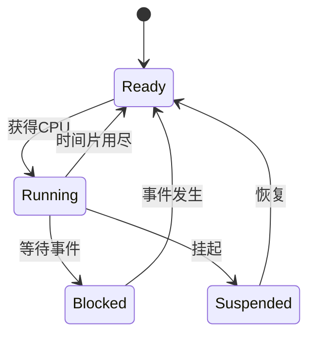

---
title: FreeRTOS 基础概念与 API 入门（STM32 新手向）
link: freertos-basic-api-stm32
date: 2026-03-31 12:00:00
description: 本文面向 STM32 新手，系统梳理 FreeRTOS 的核心概念、任务状态、关键 API 及常见开发陷阱，配套最小工程模板与可视化状态图。
cover: /img/cover/1.webp
tags:
  - FreeRTOS
  - STM32
  - 嵌入式
categories:
  - [笔记, FreeRTOS]
sticky: false
draft: false
catalog: true
math: false
quiz: false
---

# FreeRTOS 基础概念与 API 入门（STM32 新手向）

> 目标：看完这份笔记，你可以独立搭出一个“2 任务 + 1 队列 + 1 信号量”的最小 FreeRTOS 工程。

## 目录

- 1. 先建立整体认知
- 2. 任务运行状态（核心）
- 3. 关键概念：调度、Tick、临界区、堆与栈
- 4. 核心 API 速查（原生 FreeRTOS）
- 5. 从 0 到 1 最小工程心智模型
- 6. 新手高频坑与排查
- 7. 5 天入门练习清单
- 8. 原生 API 与 CMSIS-RTOS v2 对照

---

## 1. 先建立整体认知

FreeRTOS 本质是一个内核，它帮你做三件事：

1. 管理多个任务（Task）。
2. 按优先级和时机调度任务运行。
3. 提供任务间通信手段（队列、信号量、事件组等）。

你可以把它理解为“单片机上的微型操作系统内核”：

- `main()` 里做硬件初始化。
- 创建任务。
- 启动调度器。
- 从此由内核接管 CPU 分配。

---

## 2. 任务运行状态（核心）


### 2.2 任务状态流（可视化）



### 2.3 新手最容易混淆

- `Blocked` 是“被动等待条件”，条件满足会自动回到 `Ready`。
- `Suspended` 是“人为冻结”，不会自动恢复。

---

## 3. 关键概念：调度、Tick、临界区、堆与栈

### 3.1 优先级与抢占

- FreeRTOS 通常是“高优先级优先运行”。
- 抢占开启时（`configUSE_PREEMPTION=1`），更高优先级就绪会打断低优先级任务。
- 同优先级是否时间片轮转取决于 `configUSE_TIME_SLICING`。

建议：

- 先把任务优先级分成 2~3 档，不要一开始全拉开。
- 高优先级只放“短、急、关键”任务。

### 3.2 Tick 与延时

- Tick 是内核时基中断（例如 1ms 一次，取决于 `configTICK_RATE_HZ`）。
- `vTaskDelay()` 的参数单位是 Tick，不是 ms。
- 推荐用 `pdMS_TO_TICKS(ms)` 做转换。

示例：

```c
vTaskDelay(pdMS_TO_TICKS(500));
```

`vTaskDelay()` vs `vTaskDelayUntil()`：

- `vTaskDelay()`：相对延时，循环中会累积漂移。
- `vTaskDelayUntil()`：绝对周期，更适合周期任务。

### 3.3 临界区

用于保护共享资源，防止并发访问破坏数据。

任务上下文常用：

```c
taskENTER_CRITICAL();
/* critical section */
taskEXIT_CRITICAL();
```

原则：

- 临界区要短。
- 临界区内不要做阻塞操作（如队列阻塞等待）。

### 3.4 空闲任务与 Tick Hook

- 空闲任务（Idle Task）在“无任务可运行”时执行。
- 可用 Idle Hook/Tick Hook 做轻量背景工作（必须非常短）。
- 不建议在 Hook 里写复杂逻辑。

### 3.5 堆与栈（必须分清）

- 栈（Stack）：每个任务独立，存函数局部变量/调用现场。
- 堆（Heap）：系统动态分配区，任务控制块、队列等常从堆申请。

常见问题：

- 任务栈太小 -> 栈溢出。
- `heap_x.c` 选型不当或堆太小 -> 创建对象失败。

---

## 4. 核心 API 速查（原生 FreeRTOS）

> 说明：以下以原生 API 为主，CMSIS 对照见第 8 节。

### 4.1 任务管理

1. `xTaskCreate()`：创建任务。
2. `vTaskDelete()`：删除任务。
3. `vTaskDelay()`：相对延时。
4. `vTaskDelayUntil()`：固定周期延时。
5. `vTaskSuspend()` / `vTaskResume()`：挂起/恢复任务。

最小示例：

```c
xTaskCreate(TaskA, "A", 256, NULL, 2, NULL);
xTaskCreate(TaskB, "B", 256, NULL, 1, NULL);
vTaskStartScheduler();
```

### 4.2 队列（Queue）

用途：任务间传数据（最常用）。

1. `xQueueCreate(len, item_size)`
2. `xQueueSend()` / `xQueueReceive()`

示例：

```c
QueueHandle_t q = xQueueCreate(8, sizeof(uint32_t));
uint32_t v = 123;
xQueueSend(q, &v, pdMS_TO_TICKS(10));
xQueueReceive(q, &v, portMAX_DELAY);
```

注意：

- `item_size` 要和收发数据类型一致。
- 发送接收的超时参数单位是 Tick。

### 4.3 信号量与互斥量

- 二值信号量：事件同步。
- 计数信号量：资源计数。
- 互斥量：共享资源互斥，带优先级继承。

常用 API：

1. `xSemaphoreCreateBinary()`
2. `xSemaphoreCreateCounting()`
3. `xSemaphoreCreateMutex()`
4. `xSemaphoreTake()` / `xSemaphoreGive()`

建议：

- 保护共享外设（如串口）优先用互斥量。
- ISR 到任务同步常用二值信号量或任务通知。

### 4.4 事件组（Event Group）

用途：多个事件位组合判断（如“网络就绪 + 传感器就绪”）。

1. `xEventGroupCreate()`
2. `xEventGroupSetBits()`
3. `xEventGroupWaitBits()`

### 4.5 软件定时器（Software Timer）

用途：定时执行轻量回调。

1. `xTimerCreate()`
2. `xTimerStart()`
3. 回调函数中避免耗时和阻塞。

### 4.6 中断协作（ISR 与任务）

规则：

- ISR 里必须用 `FromISR` 版本 API。
- 可能触发任务切换时，调用 `portYIELD_FROM_ISR()`。

示例：

```c
BaseType_t hpw = pdFALSE;
xQueueSendFromISR(q, &data, &hpw);
portYIELD_FROM_ISR(hpw);
```

中断优先级注意：

- Cortex-M 下要确保可调用 FreeRTOS API 的中断优先级配置正确。
- 重点关注 `configMAX_SYSCALL_INTERRUPT_PRIORITY`。

---

## 5. 从 0 到 1 最小工程心智模型

### 5.1 `main()` 推荐顺序

1. 时钟/中断分组初始化。
2. 外设初始化（GPIO/UART 等）。
3. 创建通信对象（Queue/Semaphore）。
4. 创建任务。
5. `vTaskStartScheduler()` 启动调度器。

### 5.2 任务划分建议（新手版）

- 采集任务：读传感器，发队列。
- 处理任务：收队列，计算。
- 输出任务：串口/屏幕输出。

避免：

- 一个任务里什么都干。
- 多个任务同时直接操作同一外设且无互斥。

### 5.3 典型双任务流程（LED + 串口）

- 任务 A（LED）：500ms 翻转一次，证明调度在跑。
- 任务 B（UART）：每 1s 打印计数。
- 两任务优先级先设相同，确认稳定后再调优。

达标标准：

- LED 按周期闪烁。
- 串口稳定打印，系统不死机、不乱序。

---

## 6. 新手高频坑与排查

### 6.1 栈溢出

现象：莫名 HardFault、随机死机。

排查：

1. 开启栈溢出检测（`configCHECK_FOR_STACK_OVERFLOW`）。
2. 增大可疑任务栈。
3. 避免大数组放栈上，改静态或堆。

### 6.2 阻塞时间单位写错

- 把 Tick 当 ms 会导致节奏错乱。
- 统一使用 `pdMS_TO_TICKS()`。

### 6.3 ISR 调错 API

- ISR 中误用 `xQueueSend()` 而不是 `xQueueSendFromISR()`。
- 结果可能是断言失败或异常行为。

### 6.4 队列长度或元素大小不匹配

- 队列元素定义和实际收发类型不一致会导致“看似能跑但数据错乱”。

### 6.5 死锁

- 任务 A 等 B 的锁，B 又等 A 的锁。
- 保持锁顺序一致，减少嵌套锁。

### 6.6 优先级反转

- 低优先级占互斥资源导致高优先级被间接阻塞。
- 共享资源优先用互斥量（有优先级继承）。

### 6.7 `printf` 风险

- 栈占用大、耗时长、重入性风险。
- 建议：
  - 降低打印频率。
  - 避免在 ISR 内打印。
  - 关键路径用轻量日志。

---

## 7. 5 天入门练习清单

### Day 1：跑通最小双任务

- 目标：LED 任务 + UART 任务并发运行。
- 验证：LED 稳定闪烁，串口 1s 输出一次。

### Day 2：队列通信

- 目标：TaskA 发送计数到队列，TaskB 接收并打印。
- 验证：打印值连续且无丢失。

### Day 3：信号量同步

- 目标：按键中断释放信号量，任务被唤醒处理。
- 验证：无按键时任务阻塞，按下后立即响应。

### Day 4：软件定时器

- 目标：用软件定时器周期触发状态上报。
- 验证：回调按固定周期执行。

### Day 5：ISR 到任务通知

- 目标：中断使用 `FromISR` API 唤醒任务。
- 验证：中断响应后任务快速运行，系统稳定。

---

## 8. 原生 API 与 CMSIS-RTOS v2 对照

仅列最常用映射，便于读不同教程时快速切换：

- 任务创建：`xTaskCreate` <-> `osThreadNew`
- 延时：`vTaskDelay` <-> `osDelay`
- 启动调度：`vTaskStartScheduler` <-> `osKernelStart`
- 队列发送/接收：`xQueueSend/xQueueReceive` <-> `osMessageQueuePut/osMessageQueueGet`
- 信号量获取/释放：`xSemaphoreTake/xSemaphoreGive` <-> `osSemaphoreAcquire/osSemaphoreRelease`

结论：

- 新手建议先掌握原生 FreeRTOS API，再看 CMSIS 封装。
- 两者思路一致，主要差在命名和包装层。

---

## 最后检查清单（写代码前看一遍）

- Tick 与 ms 是否都用 `pdMS_TO_TICKS()` 统一转换？
- ISR 是否全部使用 `FromISR` API？
- 共享外设是否有互斥保护？
- 各任务栈大小是否留有余量？
- 阻塞等待是否都设置了合理超时？

---

## 9. 可直接运行的最小工程模板（可复制到 STM32 工程）

下面示例是一个可直接拷贝到用户工程的最小 FreeRTOS 骨架：两个任务（LED、UART），一个队列和一个互斥量。注：外设初始化（UART/GPIO）请按你的 HAL/LL 实现替换。

```c
/* 全局对象 */
QueueHandle_t g_queue;
SemaphoreHandle_t g_uartMutex;

void LedTask(void *pvParameters)
{
    (void) pvParameters;
    for (;;)
    {
        HAL_GPIO_TogglePin(LED_GPIO_Port, LED_Pin);
        vTaskDelay(pdMS_TO_TICKS(500)); // Blocked 状态
    }
}

void UartTask(void *pvParameters)
{
    (void) pvParameters;
    uint32_t cnt = 0;
    char buf[64];

    for (;;)
    {
        if (xSemaphoreTake(g_uartMutex, pdMS_TO_TICKS(50)) == pdPASS)
        {
            int n = snprintf(buf, sizeof(buf), "cnt=%lu\r\n", (unsigned long)cnt++);
            HAL_UART_Transmit(&huart1, (uint8_t*)buf, n, HAL_MAX_DELAY);
            xSemaphoreGive(g_uartMutex);
        }
        vTaskDelay(pdMS_TO_TICKS(1000));
    }
}

int main(void)
{
    HAL_Init();
    SystemClock_Config();
    MX_GPIO_Init();
    MX_USART1_UART_Init();

    g_queue = xQueueCreate(8, sizeof(uint32_t));
    g_uartMutex = xSemaphoreCreateMutex();

    if (g_queue == NULL || g_uartMutex == NULL)
    {
        Error_Handler();
    }

    xTaskCreate(LedTask, "LED", 128, NULL, 1, NULL);
    xTaskCreate(UartTask, "UART", 256, NULL, 1, NULL);

    vTaskStartScheduler(); // 不会返回，FreeRTOS 接管

    for (;;);
}
```

---

## 10. 常用 FreeRTOSConfig 宏与行为映射（快速参考）

- `configUSE_PREEMPTION = 1` : 启用抢占，优先级高的任务就绪会立即切换上 CPU。
- `configUSE_TIME_SLICING = 1` : 同优先级任务之间启用时间片轮转（若为 0 则同优先级可能不轮转）。
- `configTICK_RATE_HZ` : tick 频率（例如 1000 -> 1 tick = 1 ms），影响 vTaskDelay 等。
- `configMINIMAL_STACK_SIZE` : 默认任务最小栈大小，创建任务时要基于此合理估算。
- `configMAX_PRIORITIES` : 允许的最大优先级数量。
- `configCHECK_FOR_STACK_OVERFLOW` : 启用栈溢出检测（建议设 1 或 2 并实现 vApplicationStackOverflowHook）。
- `configUSE_MUTEXES` : 使能互斥量（优先级继承），建议用于共享外设保护。
- `configMAX_SYSCALL_INTERRUPT_PRIORITY` / Cortex-M 中断优先级配置：确保使用 FreeRTOS API 的中断优先级不高于此阈值。

在文档中应说明这些宏通常在 `FreeRTOSConfig.h` 中修改，并给出常见工程的推荐值或范围。

---

## 11. 常见错误写法与正确写法对照（训练式示例）

- 错误：在 ISR 中调用 `xQueueSend()`（会导致不可预测行为或断言）
  正确：在 ISR 中调用 `xQueueSendFromISR()` 并在需要时调用 `portYIELD_FROM_ISR()`。

- 错误：多个任务直接调用 `HAL_UART_Transmit()`（非线程安全，可能数据交错）
  正确：为串口创建一个互斥量，所有任务在发送前 `xSemaphoreTake()`，发送后 `xSemaphoreGive()`。

- 错误：队列创建时 `item_size` 与传入类型不匹配（例如 sizeof(uint32_t) 但传入结构体指针）
  正确：队列元素大小应与实际传入的数据类型完全一致，或发送指针并确保生命周期。

- 错误：在临界区中做阻塞调用（例如在 taskENTER_CRITICAL() 后调用 xQueueReceive(portMAX_DELAY)）
  正确：临界区内仅做短、小且非阻塞的操作，阻塞操作应在临界区外执行。

---

## 12. 调试与观测：如何判断栈/队列/调度问题

- 查看任务栈水位：`uxTaskGetStackHighWaterMark()` 可以返回任务已使用栈的最小剩余值（单位平台相关），用于评估是否需要增大栈。
- 实现钩子：实现 `vApplicationStackOverflowHook()` 与 `vApplicationMallocFailedHook()`，在发生问题时记录信息并安全重启或进入安全状态。
- 使用断言：启用 `configASSERT()`，并在断言回调中输出关键信息（例如当前任务名、寄存器快照）以便排查。
- 统计与事件：使用 `vTaskList()` / `vTaskGetRunTimeStats()`（如果配置启用 run-time stats）来观察任务运行情况与 CPU 占用。
- 故障注入：作为练习，有意识地缩小队列长度或把某任务栈设置偏小，观察系统表现并用以上工具定位问题。

---

## 参考快速清单（新增后）
- 可复制的最小工程模板见本节第 9 节。
- 常见错误与正确写法见第 11 节，调试方法见第 12 节。

