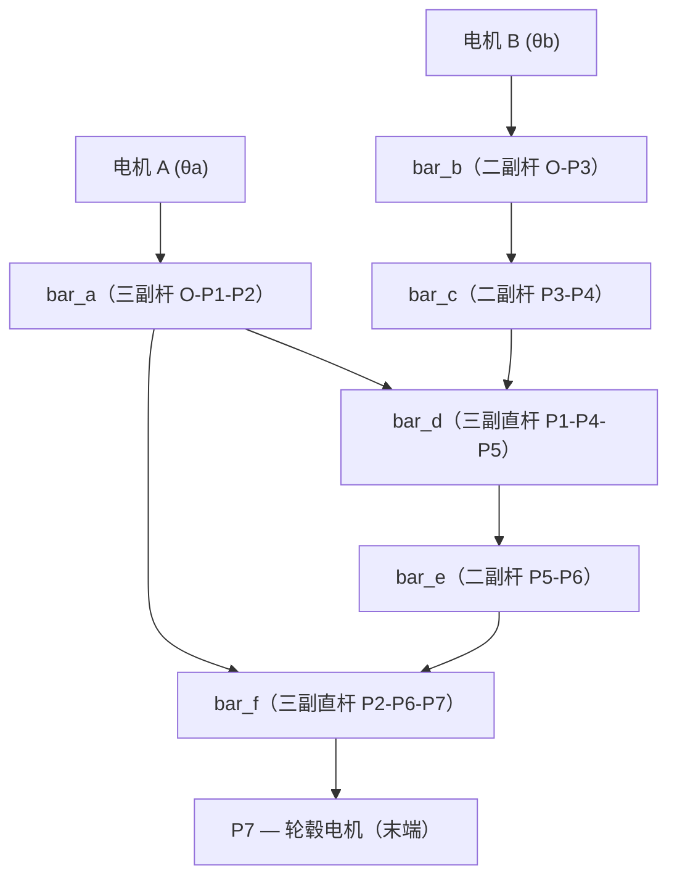

## 1. 问题背景

轮腿式机器人（wheel-legged robot）的每条腿需要同时具备 **轮式滚动** 和 **腿部越障** 两种能力。本文讨论的机构设计采用两个同轴电机，通过一套 8 字形双平行四边形连杆将动力传递到轮端，实现腿部摆动与轮子转向的解耦控制。




两个平行四边形嵌套成 8 字形：

- **平行四边形 1**：O – P1 – P4 – P3，边长 48.4 × 57.3 mm
- **平行四边形 2**：P1 – P2 – P6 – P5，边长 59 × 32.4 mm


:::info
关键之处在于：所有三副杆（bar_a、bar_d、bar_f）都是 **直杆**（三点共线）。这个几何约束是后续解析简化的核心前提。
:::

## 2. 正运动学推导

正运动学的目标是：给定电机转角 $\theta_a, \theta_b$，求末端 $P_7$ 的位置。

### 2.1 点坐标逐步求解

**Step 1 — bar_a 上的 P1、P2**

以 O 为原点，绕 $\theta_a$ 旋转：

$$
\begin{aligned}
P_1 &= L_{OP1} \begin{bmatrix}\cos\theta_a \\ \sin\theta_a\end{bmatrix}
      = 48.4 \begin{bmatrix}\cos\theta_a \\ \sin\theta_a\end{bmatrix} \\[6pt]
P_2 &= L_{OP2} \begin{bmatrix}\cos\theta_a \\ \sin\theta_a\end{bmatrix}
      = 107.4 \begin{bmatrix}\cos\theta_a \\ \sin\theta_a\end{bmatrix}
\end{aligned}
$$

这里 $L_{OP2} = 48.4 + 59 = 107.4$，因为 bar_a 是直杆，P1 在 O–P2 连线上。

**Step 2 — bar_b 上的 P3**

$$
P_3 = L_b \begin{bmatrix}\cos\theta_b \\ \sin\theta_b\end{bmatrix}
     = 57.3 \begin{bmatrix}\cos\theta_b \\ \sin\theta_b\end{bmatrix}
$$

**Step 3 — bar_d 上的 P4（两圆相交）**

由平行四边形 1 可知 $|P_1P_4|$、$|P_3P_4|$ 为固定值，故 P4 是两圆的交点：

- 圆心 $P_1$，半径 $L_{P1P4} = 57.3$
- 圆心 $P_3$，半径 $L_c = 48.4$

两圆相交一般有两个解（即两种装配模式），记作 $branch\_d = \pm 1$。

### 2.2 核心简化：直杆约束

得到 P4 后，bar_d 的方向角为：

$$
\theta_d = \text{atan2}(P_4 - P_1)
$$

因为 bar_d 是 **直杆**，P5 与 P1、P4 共线，且 $|P_1P_5| = 32.4$，所以：

$$
P_5 = P_1 + \frac{32.4}{57.3} (P_4 - P_1)
$$

代入平行四边形 2 的关系 $P_6 = P_2 + P_5 - P_1$，消去 P5：

$$
P_6 = P_2 - \frac{32.4}{57.3} (P_4 - P_1)
$$

注意 $P_4 - P_1$ 的方向与 $P_3$ 相同（平行四边形对边平行），而 $P_3 = L_b[\cos\theta_b, \sin\theta_b]^T$，于是：

$$
P_6 = P_2 - 32.4 \begin{bmatrix}\cos\theta_b \\ \sin\theta_b\end{bmatrix}
$$

bar_f 同样是直杆，P7 在 P2→P6 的反方向延长线上，$|P_2P_7| = 128$：

$$
P_7 = P_2 + 128 \begin{bmatrix}\cos\theta_b \\ \sin\theta_b\end{bmatrix}
$$

### 2.3 最终解析式

将 $P_2 = 107.4[\cos\theta_a, \sin\theta_a]^T$ 代入，得：

$$
\boxed{P_7 = \begin{bmatrix}
107.4\cos\theta_a + 128\cos\theta_b \\
107.4\sin\theta_a + 128\sin\theta_b
\end{bmatrix}}
$$

```infographic
infographic list-grid-badge-card
data
  title 物理意义
  desc 机构等价于一个标准 2R 平面机械臂
  items
    - label 第一连杆
      desc O → P₂，长 L₁ = 107.4 mm，角度 θa
      icon mdi/link-variant
    - label 第二连杆
      desc P₂ → P₇，长 L₂ = 128 mm，角度 θb
      icon mdi/link-variant
    - label 末端
      desc 轮毂电机位置 P₇
      icon mdi/wheel
```

## 3. 逆运动学推导

逆运动学：给定末端位置 $P_7 = (x, y)$，求 $\theta_a, \theta_b$。

### 3.1 余弦定理

令 $r = \sqrt{x^2 + y^2}$（P7 到原点的距离），$\phi = \text{atan2}(y, x)$。

由 2R 机械臂的几何关系：

$$
\cos\alpha = \frac{r^2 + L_1^2 - L_2^2}{2 L_1 r}
$$

$$
\alpha = \arccos\left(\frac{r^2 + 107.4^2 - 128^2}{2 \times 107.4 \times r}\right)
$$

### 3.2 两个解

$$
\theta_a = \phi \pm \alpha
$$

正号对应 **elbow-down**，负号对应 **elbow-up**（两种臂型）。

$$
\theta_b = \text{atan2}\left(
  y - L_1\sin\theta_a,\;
  x - L_1\cos\theta_a
\right)
$$

### 3.3 工作空间与奇异位形

工作空间是一个圆环：

$$
|L_1 - L_2| \leq r \leq L_1 + L_2
$$

即 $20.6 \text{ mm} \leq r \leq 235.4 \text{ mm}$。

三种奇异位形：

| 条件 | 含义 | 解的情况 |
|:---|:---|:---:|
| $r = L_1 + L_2 = 235.4$ | 完全伸展 | 单解（$\theta_a = \theta_b$） |
| $r = \|L_1 - L_2\| = 20.6$ | 完全收缩 | 单解 |
| $r = 0$ | 末端与原点重合 | 无穷多解 |


## 4. 代码实现

### 4.1 两圆相交

这是整个数值求解的几何基础——给定两个圆心和半径，求交点。

```python title="src/geometry.py" mark:3,8-9,17-18
def circle_intersection(c1, r1, c2, r2):
    """返回 (p_left, p_right)，无解时返回 (None, None)。"""
    v = c2 - c1
    d = np.linalg.norm(v)

    if d < 1e-12:          # 同心圆
        return None, None
    if d > r1 + r2 + 1e-10 or d < abs(r1 - r2) - 1e-10:
        return None, None  # 无交点

    a = (r1**2 - r2**2 + d**2) / (2.0 * d)
    h = np.sqrt(max(r1**2 - a**2, 0.0))
    p_mid = c1 + (a / d) * v

    if h < 1e-10:
        return p_mid.copy(), p_mid.copy()  # 相切

    perp = np.array([-v[1], v[0]]) / d
    return p_mid + h * perp, p_mid - h * perp
```

通过 `perp` 向量的正负号区分两个解——对应两种装配模式。

### 4.2 正运动学求解器

```python title="src/kinematics.py" mark:14-15,25-26
def solve_linkage(theta_a, theta_b, params, prev_theta_d=None, prev_theta_f=None):
    # 1. bar_a 上的 P1, P2
    P1 = rotate_vec(np.array([params.L_OP1, 0.0]), theta_a)
    P2 = rotate_vec(params._a2_local, theta_a)

    # 2. bar_b 上的 P3
    P3 = params.L_b * np.array([np.cos(theta_b), np.sin(theta_b)])

    # 3. 两圆相交求 P4
    p4_left, p4_right = circle_intersection(P1, params.L_P1P4, P3, params.L_c)
    # prev_theta_d 用于轨迹跟踪时保持分支连续性

    # 4. bar_d 方向 → P5
    theta_d = np.arctan2((P4 - P1)[1], (P4 - P1)[0])
    P5 = P1 + rotate_vec(params._d5_local, theta_d)

    # 5. 两圆相交求 P6
    p6_left, p6_right = circle_intersection(P2, params.L_P2P6, P5, params.L_e)

    # 6. bar_f 方向 → P7（末端）
    theta_f = np.arctan2((P6 - P2)[1], (P6 - P2)[0])
    P7 = P2 + rotate_vec(params._f7_local, theta_f)

    return {'P7': P7, 'theta_d': theta_d, 'theta_f': theta_f, ...}
```

整个求解过程全部由三角函数和开方完成，**无需任何迭代**，属于纯解析正解。

### 4.3 逆运动学

```python title="src/kinematics.py" mark:7,14-15,19-22
def solve_inverse(P7_target, params, elbow=1):
    L1, L2 = params.L_OP2, params.L_P2P7
    x, y = P7_target
    r = np.hypot(x, y)

    if r > L1 + L2 + 1e-6 or r < abs(L1 - L2) - 1e-6:
        return []  # 超出工作空间

    cos_alpha = (r**2 + L1**2 - L2**2) / (2.0 * L1 * r)
    alpha = np.arccos(np.clip(cos_alpha, -1.0, 1.0))
    phi = np.arctan2(y, x)

    solutions = []
    for sgn in ([-1, 1] if elbow == 0 else [elbow]):
        theta_a = phi + sgn * alpha
        theta_b = np.arctan2(
            y - L1 * np.sin(theta_a),
            x - L1 * np.cos(theta_a),
        )
        solutions.append({'theta_a': theta_a, 'theta_b': theta_b})

    return solutions
```

:::info
`elbow` 参数控制返回哪个逆解：`+1` 肘向上、`-1` 肘向下、`0` 返回全部两个解。
:::

## 5. 四种装配模式

两圆相交的 $\pm$ 选择带来了 **四种装配模式**（branch_d × branch_f），对应实际机构的不同组装方式：

```mermaid
graph TD
    subgraph branch_d = -1
        D1["P4 在 P1→P3 左侧"]
    end
    subgraph branch_d = +1
        D2["P4 在 P1→P3 右侧"]
    end
    subgraph branch_f = -1
        F1["P6 在 P2→P5 左侧"]
    end
    subgraph branch_f = +1
        F2["P6 在 P2→P5 右侧"]
    end
    D1 --> C1["(−1, −1) 凸凸"]
    D1 --> C2["(−1, +1) 凸凹"]
    D2 --> C3["(+1, −1) 凹凸"]
    D2 --> C4["(+1, +1) 凹凹"]
```

其中 `branch_d=+1, branch_f=-1` 对应两个平行四边形均为凸四边形的情况，这也是 2R 简化成立的默认模式。

+++primary 关于装配连续性的细节
轨迹跟踪时，每一帧的 `solve_linkage` 会传入上一帧的 $\theta_d, \theta_f$，在两圆相交的两个解中选取与上一帧更接近的那个。这样就能在连续运动中保持同一装配模式，避免跳跃。

```python
# 选取与上一帧更接近的 P4
P4 = p4_left if norm(p4_left - P4_prev) <= norm(p4_right - P4_prev) else p4_right
```
++

## 6. 验证

| $\theta_a$ | $\theta_b$ | $P_7$（解析） | $P_7$（数值） |
|:---:|:---:|:---|:---:|
| 0° | 90° | (107.4, 128.0) | (107.4, 128.0) ✓ |
| 30° | 120° | (29.0, 164.6) | (29.0, 164.6) ✓ |
| 0° | 0° | (235.4, 0.0) | (235.4, 0.0) ✓ |
| −30° | 45° | (183.5, 36.8) | (183.5, 36.8) ✓ |

## 7. 总结

这套 8 字形双平行四边形机构巧妙地利用了 **直杆共线** 约束，使得看似复杂的连杆传动链最终简化为一个 2R 平面机械臂。正逆运动学均有闭式解析解，无需数值迭代，非常适合嵌入式实时控制场景。

如果你对完整代码感兴趣，项目在 GitHub 上开源：

https://github.com/729DHS/linkage-2dof

```bash
# 快速体验
git clone https://github.com/729DHS/linkage-2dof.git
cd linkage-2dof
uv sync
python main.py interactive   # 交互式滑块
python main.py anim          # 生成动画
python main.py ik            # 逆运动学演示
```

---

> **图片部署**：将 `linkage-2dof/pic/` 下的三张图片复制到博客 `public/img/linkage/` 目录即可正常显示。
