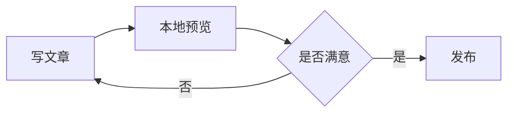

---
# 必填：文章标题
title: 这里填写文章标题

# 可选：固定链接 slug（建议小写 + 短横线，发布后尽量不要改）
link: your-post-slug

# 必填：发布时间（建议格式：YYYY-MM-DD HH:mm:ss）
date: 2026-03-27 12:00:00

# 可选：文章摘要（用于列表和 SEO）
description: 这里填写文章摘要

# 可选：封面图（public 目录下的路径）
cover: /img/cover/1.webp

# 可选：标签（可写多个）
tags:
  - 标签1
  - 标签2

# 可选：分类
# 单层示例：
# categories:
#   - 随笔
#
# 嵌套示例（推荐）：
# categories:
#   - [笔记, 前端]
# 注意：分类名必须在 config/site.yaml 的 categoryMap 中有映射
categories:
  - [笔记, 分类名]

# 可选：置顶（默认 false，不置顶）
sticky: false

# 可选：草稿（默认 false，发布）
draft: false

# 可选：是否生成目录
catalog: true

# 可选：是否启用数学公式渲染（内容含公式时再开）
math: true

# 可选：是否启用练习题渲染（内容含 quiz 语法时再开）
quiz: true
---

# 全功能 Markdown 模板（给 AI 的示例库）

这份模板收录了 astro-koharu 目前常用的 Markdown 增强能力。

使用建议：

- 新建文章时，按需保留对应模块，删除不用的示例。
- 若用了数学公式/练习题，请确保 frontmatter 里的 `math` / `quiz` 开关已开启。
- 若用了加密内容，请务必使用强密码，不要把真实密码写进公开仓库文档。

## 1. 基础 Markdown + GFM

### 标题层级

#### 四级标题

##### 五级标题

###### 六级标题

### 文本样式

- **粗体**
- _斜体_
- ~~删除线~~
- `行内代码`
- [普通链接](https://example.com)

### 表格

| 功能 | 状态 | 说明 |
| :--- | :--: | ---: |
| 表格 |  ✅  | 支持对齐 |
| 任务列表 | ✅ | 支持复选框 |

### 任务列表

- [x] 已完成事项
- [ ] 待办事项

### 引用

> 这是一段引用内容。
>
> 可以跨多行。

### 分割线

---

## 2. 代码块增强（Shiki + Meta）

### 普通代码高亮

```ts
function greet(name: string) {
  return `Hello, ${name}`;
}

console.log(greet('Koharu'));
```

### 带标题、链接、行高亮

```ts title="demo.ts" url="https://example.com/demo.ts" linkText="查看源码" mark:1,4
const appName = 'astro-koharu';

function boot() {
  console.log(`${appName} booted`);
}

boot();
```

### 命令提示符

```bash command:("$":1-3)
pnpm install
pnpm lint:fix
pnpm build
```

## 3. 数学公式（KaTeX）

行内公式：$E = mc^2$

块级公式：

$$
\int_{-\infty}^{\infty} e^{-x^2} dx = \sqrt{\pi}
$$

## 4. Mermaid 图表



## 5. Infographic 信息图

```infographic
infographic list-grid-badge-card
data
  title 技术栈示例
  desc 用于演示 infographic 语法
  items
    - label Astro
      desc 内容站框架
      icon mdi/rocket-launch
    - label React
      desc 交互组件
      icon mdi/react
    - label Tailwind CSS
      desc 原子化样式
      icon mdi/tailwind
```

## 6. 链接嵌入（独行链接）

独行 Tweet/X 链接（会尝试嵌入）：

https://x.com/vercel_dev/status/1997059920936775706

独行普通链接（会尝试 OG 预览）：

https://github.com/vercel/react-tweet

独行 CodePen 链接（会尝试嵌入）：

https://codepen.io/botteu/pen/YPKBrJX/

段落内链接不会被嵌入：[react-tweet](https://github.com/vercel/react-tweet)

## 7. 图片（支持占位与懒加载增强）


## 8. Shoka 文本语法

### 下划线 / 高亮 / 上下标

++这是下划线++

==这是高亮==

H~2~O 与 E = mc^2^

### 颜色文字 / 彩虹 / 键帽

[红色]{.red} [蓝色]{.blue} [绿色]{.green}

[这是一段彩虹文字]{.rainbow}

[Ctrl]{.kbd} + [C]{.kbd}

### 标签

[默认]{.label .default} [主要]{.label .primary} [成功]{.label .success} [危险]{.label .danger}

### Spoiler 隐藏文字

这里有一段!!点击显示的隐藏文字!!

这里有一段!!悬停显示的模糊文字!!{.blur}

### Ruby 注音

{漢字^かんじ} 注音示例。

## 9. 容器块（Note / Collapse / Tabs）

### Note 提醒块

:::info
这是一条信息提示。
:::

:::warning
这是一条警告提示。
:::

:::danger
这是一条危险提示。
:::

### Collapse 折叠块

+++primary 点击展开更多说明
这里是折叠内容，支持 **Markdown**。

- 列表项 A
- 列表项 B
++

### Tabs 标签卡

````markdown
;;;tab1 JavaScript
```js
console.log('hello from js');
```
;;;

;;;tab1 Python
```python
print('hello from python')
```
;;;
````

;;;tab1 JavaScript
```js
console.log('hello from js');
```
;;;

;;;tab1 Python
```python
print('hello from python')
```
;;;

## 10. 友链卡片（links）

```markdown

- site: 示例站点
  url: https://example.com
  owner: Alice
  desc: 一个示例友链
  image: https://api.dicebear.com/7.x/avataaars/svg?seed=Alice
  color: '#BEDCFF'

```


- site: 示例站点
  url: https://example.com
  owner: Alice
  desc: 一个示例友链
  image: https://api.dicebear.com/7.x/avataaars/svg?seed=Alice
  color: '#BEDCFF'


## 11. 多媒体（media）

### 音频

```markdown

- name: 示例音频
  url: https://music.163.com/#/song?id=3339210292

```


- name: 示例音频
  url: https://music.163.com/#/song?id=3339210292


### 视频

```markdown

- name: 示例视频
  url: https://cdn.kastatic.org/ka-youtube-converted/O_nY1TM2RZM.mp4/O_nY1TM2RZM.mp4#t=0

```


- name: 示例视频
  url: https://cdn.kastatic.org/ka-youtube-converted/O_nY1TM2RZM.mp4/O_nY1TM2RZM.mp4#t=0


## 12. 练习题（quiz）

### 单选题

- JavaScript 的基本数据类型是？{.quiz}
  - Object{.options}
  - Array{.options}
  - Symbol{.correct}
  - Function{.options}

> 解析：`Symbol` 是基本数据类型之一。

### 多选题

- 以下哪些是 CSS 布局方式？{.quiz .multi}
  - Flexbox{.correct}
  - Grid{.correct}
  - Float{.correct}
  - jQuery{.options}

### 判断题

- `const` 声明的对象属性可以修改。{.quiz .true}

### 填空题

- 在 JavaScript 中，`typeof null` 的结果是 [object]{.gap}。{.quiz .fill}

## 13. 加密内容块（encrypted）

示例源码：

````markdown
:::encrypted{password="demo"}
这段内容会在构建时加密，输入密码后可查看。

```ts
console.log('encrypted content');
```
:::
````

实际渲染：

:::encrypted{password="demo"}
这段内容会在构建时加密，输入密码后可查看。

```ts
console.log('encrypted content');
```
:::

## 14. 给 AI 的提示建议（可选保留）

你可以在文章末尾追加这段给 AI 的写作提示：

```text
请按本模板语法写作：
1) frontmatter 字段完整
2) 有至少 1 个 Mermaid 或 Infographic
3) 如出现公式则设置 math: true
4) 如出现练习题则设置 quiz: true
5) categories 必须匹配 config/site.yaml 的 categoryMap
```

这里开始写正文内容。

## 小节标题

- 要点 1
- 要点 2

```ts
// 代码示例
console.log('Hello template');
```
